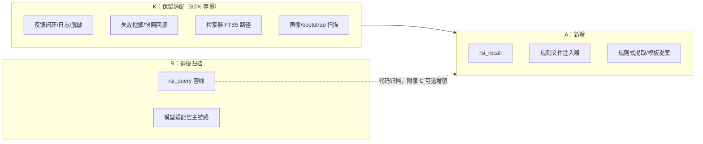

# RSI Boot — 实施计划 (Plans)

> 版本：v3.0 | 日期：2026-09-11 | 状态：正式版（跟随 PRD/Spec v3.0 定位转向）
> 前版：v2.6 见 `2026-09-10-rsi-boot-plan.md`（M1~Phase 4 已全部交付，代码存量作为本版改造基座）

---

## 修订记录

| 版本 | 日期 | 修订人 | 变更内容 |
|------|------|--------|----------|
| v3.0 | 2026-09-11 | PO/架构 | 跟随 PRD/Spec v3.0 定位转向：任务体系从「四阶段新建」改为「改造基座上的减法 + 新增」。R 系列（Remove/退役）3 项、A 系列（Add/新增）6 项、K 系列（Keep/适配）6 项；总工作量 19 人天（存量复用约 60%） |
| v3.1 | 2026-09-11 | PO/架构 | 新增 A7 规则冲突检测（1.5d，Spec §4.9）：学习记忆与用户手写规则矛盾/过时/重复时提醒用户裁决；A5 迁移范围扩为 003+004。总工作量 20.5 人天 |

> **实现工作约定**：Plans 只负责任务分解、工期与验收；实现细节以 **Spec v3.0 为唯一权威依据**。Plans 与 Spec 冲突时以 Spec 为准，并回写修正 Plans。

---

## 1. 改造总览

v2.6 已交付 229 项测试通过的完整实现。v3.0 不是重写，是在该基座上：



## 2. 任务分解

### R 系列：退役与归档（3d）

| 编号 | 任务 | 验收 | 工时 | 实现依据 |
|------|------|------|------|----------|
| R1 | rsi_query 工具下线：`serve` 工具清单移除，Pipeline 不再装配 | tools/list 无 rsi_query；存量测试相应调整 | 1d | Spec §6 |
| R2 | 模型调用层归档：model/、cost_router、response_cache、budget 移入 `enhance` 装配入口（默认关闭） | 无 Key 启动无 warning 噪声；`enhance.*` 配置可启用 | 1d | Spec 附录 C |
| R3 | 配置命名空间迁移：`model.*` → `enhance.*`，旧配置启动提示 | 旧配置检出日志提示；default.yaml 重写 | 1d | Spec §10 |

### A 系列：新增（11.5d）

| 编号 | 任务 | 验收 | 工时 | 实现依据 |
|------|------|------|------|----------|
| A1 | rsi_recall 工具：task→记忆召回（禁止项置顶 + FTS5/bigram + 召回臂）+ recall 事件落库 + feedback_token 签发 | 契约测试；召回 P99 < 200ms；事件可关联反馈 | 3d | Spec §4.3/§6 |
| A2 | 规则文件注入器：RuleTarget 协议 + CursorRuleTarget（.mdc frontmatter）+ AgentsMdTarget（托管块）+ 全量重写 + 去重锁 | 记忆变更后文件同步重写；块外内容不动；容量裁剪生效 | 3d | Spec §4.2 |
| A3 | 规则式知识提取：modified/rejected+comment/高分三类规则 + 标题级去重 | 三类候选各产出正确草稿；无 LLM 调用 | 2d | Spec §4.4 |
| A4 | 模板化提案生成 + 零 Key 门禁（静态校验五项 + 黑名单过滤） | 三类失败模式产出合法提案；校验否决路径正确 | 1d | Spec §4.5/§4.6 |
| A5 | 迁移 003+004：rule_artifacts / rule_conflicts 表 + 台账读写 | 迁移幂等；台账与实际文件一致 | 0.5d | Spec §5.2 |
| A6 | rsi_stats 口径重写：触达率/采纳率/禁止项遵循率/提案通过率 | 新指标计算正确；导出沿用 | 0.5d | Spec §6 |
| A7 | 规则冲突检测：用户手写规则扫描（只读）+ 三类启发式判定 + rsi_conflicts 工具（list/resolve 三选一流转）+ 周定时全量扫描 | 三类冲突各产出正确记录；user_wins 后记忆 suppressed 不再注入；memory_wins 后检测用户文件变更自动关闭 | 1.5d | Spec §4.9 |

### K 系列：保留适配（6d）

| 编号 | 任务 | 验收 | 工时 | 实现依据 |
|------|------|------|------|----------|
| K1 | 反馈闭环适配：rsi_feedback 挂接 recall 事件；reward 映射到召回臂 | 反馈驱动召回臂 alpha/beta 更新 | 1.5d | Spec §4.7 |
| K2 | 失败挖掘适配：负信号源改 recall 反馈（rejected/rating≤2/ignored 率高） | 分桶正确，证据绑定 recall 日志 | 1d | Spec §4.5 |
| K3 | 检索器适配：默认无 vec 路径固化；embedding 移增强层 | 无 Key 检索全绿；增强开启后混合检索生效 | 1d | Spec §4.3 |
| K4 | 画像适配：输入源改 recall/反馈事件 | 画像增量/离线聚合正确 | 1d | Spec §4.8 |
| K5 | bootstrap 适配：扫描产出走审批流 + 注入器 | dry-run/正式学习产出入待审队列 | 1d | PRD M2 |
| K6 | 调度器适配：每日（提取/巡检/归档）+ 每周（召回臂调优/Harness 周期） | 任务按周期触发，无 LLM 依赖 | 0.5d | Spec §4 |

## 3. 里程碑与依赖

```
Week 1:  R1-R3（退役）→ A5（迁移）→ A2（注入器）
Week 2:  A1（recall）→ A3/A4（学习零 Key 化）        ← M1 记忆闭环最小形态
Week 3:  K1-K6（适配）+ A6（统计）+ A7（冲突检测）    ← M2 学习深化
Week 4:  全量回归 + 宿主实测（Cursor 双通道验证）      ← 发布候选
```

关键路径：A2（注入器）是价值出口，阻塞最终验证；A1 依赖 K3（检索器适配）。

## 4. 验收标准

| 维度 | 标准 |
|------|------|
| 零 Key 全流程 | 无 Key 环境：反馈→提取→审批→规则文件→宿主上下文 端到端可演示 |
| 场景 A 实测 | Cursor 中制造一次纠正 → 次日规则文件含对应禁止项 → 新任务宿主输出不再违反 |
| 双通道 | 规则文件注入（确定性）+ rsi_recall 宿主自动调用（描述驱动）均生效 |
| 回归 | 存量测试适配后全绿；新增测试覆盖 A/R/K 各系列 |
| 可审计 | 任一规则文件可溯源到来源条目与审批记录；回滚后文件 1 分钟内恢复 |

## 5. PRD v3.0 需求追溯

| PRD 需求 | 任务 |
|----------|------|
| rsi_recall / 规则注入 / 反馈 / 日志 / 规则式提取 / 审批 / 挖掘 / 模板提案 / 快照 / 脱敏（M1 十条 P0） | A1/A2/K1/存量/A3/存量/K2/A4/存量/存量 |
| 召回策略学习 / 画像 / bootstrap / 巡检 / elicitation / 生命周期 / 冲突检测 / 多宿主 / rsi_stats（M2 九条 P1） | K1/K4/K5/存量/后续/存量/A7/A2 扩展/A6 |
| LLM 增强五项（Phase 3 P2） | R2 归档 + 附录 C 按需 |

## 6. 风险与应对

| 风险 | 应对 |
|------|------|
| 存量测试大面积失效（rsi_query 下线） | R1 先行，测试按「归档标记」批量迁移；保留 pipeline 测试为 enhance 套件 |
| 宿主不自动调用 rsi_recall | A1 工具描述 A/B 调优；注入器为确定性主通道，召回为补充 |
| Cursor 规则格式变更 | RuleTarget 协议隔离载体细节；格式升级只改 CursorRuleTarget |
| 规则式提取质量不足 | 审批闸门兜底；elicitation（M2）与 LLM 增强（附录 C）两级升级路径 |
