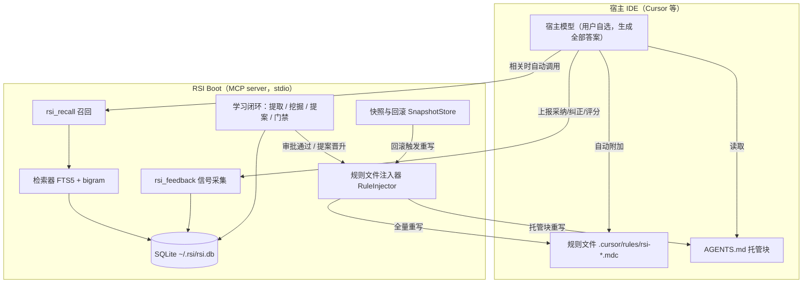
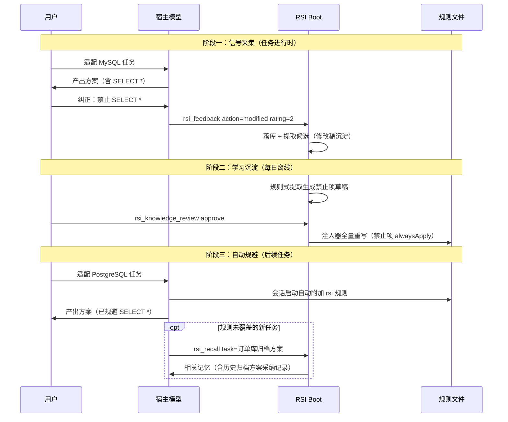
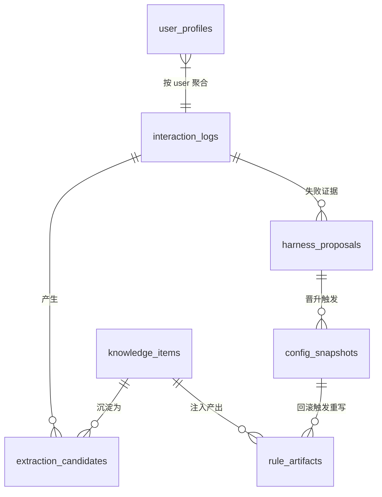

# RSI Boot — 技术设计规范 (Spec)

> 版本：v3.0 | 日期：2026-09-11 | 状态：正式版（定位转向：零 Key 宿主记忆层）
> 前版：v2.6 见 `2026-09-10-rsi-boot-spec.md`；v2.6 中被本版取代的章节以本文为准，未提及的机制（迁移、脱敏、快照等）沿用 v2.6 对应章节。

---

## 修订记录

| 版本 | 日期 | 修订人 | 变更内容 |
|------|------|--------|----------|
| v3.0 | 2026-09-11 | PO/架构 | 定位转向（动因见 PRD v3.0 §1）：主链路去 LLM 化——rsi_query 管线退役，新增 rsi_recall 工具与规则文件注入器双触达通道；知识提取/提案生成默认规则式（零 Key），LLM 实现移入附录 C 可选增强层；召回策略学习（Thompson 作用于召回臂）；新增 rule_artifacts 表（迁移 003）；MCP 工具契约重排；安全章节新增规则文件注入面防护 |
| v3.1 | 2026-09-11 | PO/架构 | 新增 §4.9 用户规则冲突检测：学习记忆与用户手写规则（非 rsi- 前缀）的矛盾/过时/重复三类启发式检测，`rsi_conflicts` 工具承载查询与三选一裁决（user_wins/memory_wins/coexist）；新增 rule_conflicts 表（迁移 004）；冲突 open 期间学习记忆照常注入（审批闸门已背书），冲突仅作提醒 |

---

## 1. 设计目标与定位

### 1.1 核心定位

RSI Boot 是**宿主模型的程序性记忆层**：一个零 API Key 可用的本地 MCP 工具，负责把用户与宿主 AI 交互中产生的经验教训，经 Harness-RSI 学习闭环沉淀为程序性记忆（知识/技能/禁止项），并在后续相关任务中自动触达宿主模型上下文。

主链路不调用任何 LLM：所有生成由宿主模型完成（透传）。RSI Boot 自身只做**存储、检索、学习、注入**四类确定性工作。

### 1.2 设计原则

| 原则 | 说明 |
|------|------|
| 零 Key 优先 | 任何核心功能在无 LLM/Embedding Key 时完整可用；Key 仅解锁附录 C 增强项 |
| 触达确定性 | 记忆触达以「规则文件注入」为确定性主通道（文件写入即生效），工具召回为按需补充 |
| 学习可审计 | 每条自动变更绑定失败证据、经审批闸门、可快照回滚（沿用 v2.6 §3.9 安全边界） |
| 宿主无关 | 产出为标准文件与 MCP 工具；Cursor 规则为一等载体，AGENTS.md 托管块通用兜底 |
| 减法优先 | v2.6 模型调用层整体移出主链路；代码归档保留，装配默认关闭 |

---

## 2. 系统架构

### 2.1 架构总览



关键依赖关系：宿主模型是唯一的生成者；RSI Boot 的产出物只有两种形态——**文件**（规则/托管块，宿主自动加载）与**工具返回**（rsi_recall 结果，宿主自动调用）。学习闭环的唯一人工触点是审批。

### 2.2 模块职责矩阵

| 模块 | 职责 | 不做什么 |
|------|------|----------|
| `api/`（MCP 工具层） | rsi_recall / rsi_feedback / rsi_knowledge_* / rsi_review / rsi_stats 的协议适配 | 不生成内容 |
| `knowledge/` | 记忆条目 CRUD、FTS5+bigram 检索、（可选）embedding 增强 | 不调用 LLM 生成 |
| `learning/` | 规则式知识提取、失败挖掘、模板化提案、门禁校验、快照 | 无 Key 时不做语义级评估 |
| `injector/`（新增） | 学习产出 → 规则文件 / AGENTS.md 托管块的全量重写 | 不增量编辑用户手写内容 |
| `injector/conflict.py`（新增） | 用户手写规则与学习记忆的冲突检测与解决流转（§4.9） | 只读用户文件，绝不修改；零 Key 下不做语义级判定 |
| `strategy/` | 召回策略臂的 Thompson 学习（臂 = 召回参数组合） | 不再路由模型 |
| `services/` | 事件日志、画像、统计（口径重写为记忆使用指标） | 不记录 token 成本 |
| `feedback/` | 显式/隐式反馈协议与异步消费（沿用 v2.6 §4.2） | — |
| `data/` | SQLite、迁移、熔断器（本地依赖韧性沿用） | — |
| `model/`（归档） | 附录 C 可选增强层的 LLM 调用 | 主链路不装配 |

### 2.3 进程内运行时结构

沿用 v2.6 §2.4（TTLCache 画像/检索缓存、asyncio.Queue 反馈队列、熔断器），删除响应缓存与 LLM 并发信号量（无模型调用）。新增：

| 结构 | 实现 | 容量/TTL | 用途 |
|------|------|----------|------|
| 召回臂缓存 | 内存 dict | 60s 刷新 | Thompson 臂读取不阻塞召回（沿用策略缓存机制） |
| 注入去重锁 | asyncio.Lock | 进程生命周期 | 规则文件重写串行化（多变更事件合并为一次重写） |

---

## 3. 业务流程

### 3.1 核心流程：从踩坑到自动规避



### 3.2 业务节点简述

| 节点 | 输入 | 输出 | 说明 |
|------|------|------|------|
| 信号采集 | 宿主上报的 action/rating/modified_content | interaction_logs 行 + 提取候选 | 沿用 v2.6 §4.2 字段级映射；显式反馈同步落库 |
| 规则式提取 | 候选队列（modified/rejected/高分） | 待审知识草稿 | 零 Key，见 §4.4 |
| 审批 | 草稿/提案 | active 或 rejected | 唯一人工触点；可配置 auto_apply 跳过 |
| 注入重写 | 项目全部 active 记忆 | 规则文件 + 托管块 | 全量幂等重写，见 §4.2 |
| 冲突检测 | 用户手写规则 + active 记忆 | 疑似冲突记录 | 重写后增量 + 每周全量，见 §4.9 |
| 自动附加 | 规则文件 | 宿主上下文 | 宿主原生机制，RSI Boot 不参与 |
| 主动召回 | task 描述 | 记忆列表 | 宿主按工具描述自动调用，见 §4.3 |

---

## 4. 核心设计

### 4.1 记忆模型

三类程序性记忆，统一存 `knowledge_items`（技能为文件槽，沿用 v2.6 §3.9）：

| 类型 | content_type | 触达方式 | 来源 |
|------|-------------|----------|------|
| 禁止项 | `prohibition` | 规则文件 alwaysApply=true（最高优先） | rejected+comment / 提案 |
| 经验约定 | `convention` | 规则文件 description 触发 | modified 沉淀 / 高分问答 / bootstrap |
| 参考知识 | `documentation` | rsi_recall 召回 | 手动添加 / bootstrap |
| 技能 | 文件槽 SKILL.md | 规则文件 globs 挂载 + 召回 | 提案晋升 / 手动 |

禁止项单独成类的动因：其触达必须是**确定性的**（alwaysApply），不能依赖宿主的相关性判断——「不再犯同类错误」是核心指标（PRD 场景 A）的承载者。

### 4.2 触达通道一：规则文件注入器（RuleInjector）

**产出物与格式**（Cursor 为一等载体）：

```
<project>/.cursor/rules/rsi-<slug>.mdc
---
description: <标题 + 领域标签，宿主据此做相关性触发>
globs: <按 domain 映射；通用经验为空>
alwaysApply: <prohibition=true，其余=false>
---
<记忆内容（脱敏后）>
```

| 规则 | 约定 |
|------|------|
| 命名空间 | 一律 `rsi-` 前缀；用户手写规则不此前缀，互不干扰 |
| 重写语义 | 全量幂等重写：任何记忆变更（add/review/delete/晋升/回滚）触发该项目全部 rsi-* 文件重建；用户手改会被覆盖（README 明示） |
| 单文件粒度 | 每条 prohibition 一个文件（保证 alwaysApply 集合精确）；convention 按 domain 聚合为一个文件 |
| 容量上限 | 单文件 ≤ 4000 字符；项目规则总量 ≤ 32KB（超出按最近采纳率裁剪，裁剪事件记日志） |
| AGENTS.md | `<!-- rsi-boot:begin -->` / `<!-- rsi-boot:end -->` 托管块内重写，块外内容不动；无 AGENTS.md 则创建 |
| 多宿主 | M2 扩展 `.claude/skills/` 等；注入器按「载体适配器」接口设计（`RuleTarget` 协议：write(project, memories)） |

**防注入安全**：注入内容 = 宿主上下文的一部分，属提示词注入面。三道闸：① 内容经 §8.1 十条规则脱敏；② 默认经人工审批才入 active（auto_apply 默认 false）；③ 内容过滤——拒绝包含「忽略先前指令」类元指令模式的书写（正则由 `config/injection_blocklist.yaml` 维护）。

### 4.3 触达通道二：rsi_recall 主动召回

宿主模型按工具描述自动调用（描述契约见 §6）。召回排序：

1. 禁止项命中（FTS5/bigram 匹配 task）一律置顶，不受分数门槛限制；
2. 其余按 v2.6 §3.2 检索管线（无 Key 时纯 FTS5 + CJK bigram；embedding 为可选增强）；
3. 召回参数由策略臂决定（§4.7）。

每次召回落一行 interaction_logs（`intent='recall'`，token 字段为 0），`retrieved_tags` 记录命中条目——反馈闭环据此计算采纳率。

### 4.4 零 Key 规则式知识提取

替代 v2.6 的 LLM 提取（降级为附录 C 增强）。每日任务处理 `extraction_candidates`：

| 候选类型 | 提取规则 | 产出 |
|----------|----------|------|
| modified（diff>20%） | 取 modified_content 全文为答案，raw_input 摘要（≤200 字符）为题 | `convention` 草稿 |
| rejected + comment | comment 全文，前缀规范化「禁止：」 | `prohibition` 草稿 |
| rating ≥ 4 | 问答对直接沉淀（question=raw_input 摘要，answer=response_excerpt） | `convention` 草稿 |
| 重复检测 | 标题 FTS 完全匹配 → 合并（刷新 updated_at）；无语义去重（embedding 属增强） | — |

规则式提取的精度代价由审批闸门兜底：草稿一律 pending_review，宁缺毋滥。

### 4.5 失败挖掘与模板化提案

失败挖掘沿用 v2.6（负信号 = rejected / rating≤2 / 反馈推导低质量；按 intent×strategy 分桶，min_samples=5）。提案生成改模板化（零 Key）：

| 失败模式 | 提案模板 | 槽位 |
|----------|----------|------|
| 桶内 rejected+comment 集中 | 汇总 comment 生成禁止项条目 | knowledge |
| 某召回臂采纳率显著低于均值 | 调整召回参数（切换臂配置） | strategy |
| 某 domain 记忆长期零采纳 | 下线该 domain 低质条目 | knowledge |

提案约束沿用 v2.6 §3.9：单槽位、单轮 ≤5、单槽位周 ≤3、payload 含 before/after 与失败桶证据。LLM 提案生成（更精准的失败归因）为附录 C 增强。

### 4.6 门禁与快照（零 Key 形态）

- **静态校验**（默认）：最小化五项（单槽位/单目标/diff≤50 行/绑定失败桶/含 before-after）+ 脱敏扫描 + 注入黑名单过滤，任一不过即 rejected；
- **人工确认**：静态校验通过 → approved 待人工晋升（auto_apply=true 时直接晋升，不推荐初期开启）；
- **回放回归门禁**：需生成能力，整体移入附录 C（配 Key 启用）；
- **快照/回滚/观察期巡检**：完全沿用 v2.6 §3.9（纯文件/DB 操作，零 Key 可跑）。回滚后触发注入器重写，宿主上下文 1 分钟内恢复。

### 4.7 召回策略学习（Thompson 重定向）

Thompson Sampling 的作用对象从「模型/模板路由」重定向为「召回参数臂」：

| 臂 | top_n | 门槛 | 禁止项置顶 |
|----|-------|------|-----------|
| conservative | 3 | 0.7 | 是 |
| balanced（默认） | 5 | 0.6 | 是 |
| generous | 8 | 0.5 | 是 |

臂定义存 `strategy_configs`（intent='recall' 维度），alpha/beta 更新、60s 臂缓存、周衰减与淘汰全部沿用 v2.6 §3.3/§4.3。reward 映射：accepted/copied/referenced=+2，ignored=0，modified=-0.5，rejected=-1（沿用 §4.2 映射表）。

### 4.8 用户画像

沿用 v2.6 §3.8 全部机制（双层存储/缓存/衰减/离线聚合），输入源调整为：recall 事件的 retrieved_tags 命中计数、反馈兴趣加权（copied/referenced +1）、bootstrap 扫描信号。preferences.* 不从隐式行为改写的约束不变。

### 4.9 用户规则冲突检测

学习记忆与用户**手写**规则（非 `rsi-` 前缀的 `.mdc`、AGENTS.md 托管块外内容、遗留 `.cursorrules`）可能矛盾——典型情形：用户很久以前写的规则已过时，而新学到的禁止项与之相反。注入器**绝不修改用户文件**，因此冲突只能检测并提醒用户裁决。

**检测时机**：① 每次注入重写后增量扫描；② 每周定时全量扫描（捕捉「用户规则随时间过时」）；③ `rsi_conflicts list` 手动触发。

**零 Key 启发式**（无语义理解，产出为「疑似」级别，由用户裁决）：

| 冲突类型 | 判定规则 | 含义 |
|----------|----------|------|
| `contradiction` | 取禁止项 key phrase（标题去「禁止：」前缀），在用户规则中命中，且命中句（±50 字符窗口）无极性相反的禁止词（禁止/不要/避免/严禁/never/avoid）或含许可词（允许/可以/建议/使用/prefer） | 用户规则与学习禁止项方向相反 |
| `stale` | 用户规则文件 mtime > 90 天，且同 key phrase 的学习记忆近 30 天被采纳 ≥ 3 次 | 旧规则疑似已被实践淘汰 |
| `overlap` | 用户规则与学习 convention 标题 FTS 匹配且极性一致 | 内容重复，建议用户删除手写副本（rsi 侧已自动维护） |

**默认策略**：冲突 open 期间学习记忆**照常注入**（它已过审批闸门），冲突仅作提醒——避免检测误报阻断已确认的经验。

**解决流转**（`rsi_conflicts resolve`，三选一）：

| 裁决 | 系统行为 |
|------|----------|
| `user_wins` | 学习记忆置 `suppressed`（保留在库、不再注入），记录裁决原因；后续同 key phrase 的新草稿在审批界面提示「曾被用户否决」 |
| `memory_wins` | 返回用户规则的文件路径与冲突摘录，请用户手动修改；系统记录该文件 hash，下次扫描发现文件已变更则自动关闭冲突 |
| `coexist` | 标记两者共存，该对组合不再提醒（UNIQUE 约束防重复） |

LLM 语义级冲突判定（识别措辞不同但语义相反的规则）为附录 C 可选增强（`enhance.conflict_llm`）。

---

## 5. 数模设计

### 5.1 ER 图



### 5.2 表设计

沿用 v2.6 §2.2 全部表（interaction_logs / user_profiles / knowledge_items / strategy_configs / harness_proposals / config_snapshots / extraction_candidates），字段语义调整：

| 表 | 调整 |
|----|------|
| interaction_logs | 记录 recall 与反馈事件；`intent='recall'` 标识召回；model_name/token/cost 字段恒 NULL/0（无模型调用）；quality_score 由反馈信号推导 |
| knowledge_items | content_type 新增 `prohibition` / `convention` 枚举值 |
| strategy_configs | intent='recall' 行承载召回臂（§4.7） |

**新增表（迁移 003_rule_artifacts.sql）**：

| 字段 | 类型 | 约束 | 说明 |
|------|------|------|------|
| id | TEXT | PK | UUID hex |
| project_id | TEXT | NOT NULL | 项目命名空间 |
| target | TEXT | NOT NULL | 载体标识（cursor_rule / agents_md / claude_skill） |
| target_path | TEXT | NOT NULL | 写出的文件路径（相对项目根） |
| source_item_id | TEXT | 引用 knowledge_items.id | 来源记忆（聚合文件为 NULL） |
| content_hash | TEXT | NOT NULL | SHA-256，变更检测与审计 |
| status | TEXT | NOT NULL | active / removed |
| created_at / updated_at | TEXT | NOT NULL | ISO8601 UTC |

UNIQUE(project_id, target, target_path)；索引 (project_id, status)。用途：注入产物台账——回滚重写、审计「宿主上下文里当前有哪些记忆」、多宿主扩展。

**新增表（迁移 004_rule_conflicts.sql）**——用户手写规则与学习记忆的冲突记录（§4.9）：

| 字段 | 类型 | 约束 | 说明 |
|------|------|------|------|
| id | TEXT | PK | UUID hex |
| project_id | TEXT | NOT NULL | 项目命名空间 |
| item_id | TEXT | 引用 knowledge_items.id | 冲突的学习记忆侧 |
| user_rule_path | TEXT | NOT NULL | 用户规则文件路径（相对项目根） |
| user_rule_excerpt | TEXT | NOT NULL | 冲突摘录（脱敏后，≤500 字符） |
| user_rule_hash | TEXT | NOT NULL | 用户文件 SHA-256；memory_wins 后据此检测用户已修改 |
| conflict_type | TEXT | NOT NULL | contradiction / stale / overlap |
| status | TEXT | NOT NULL | open / user_wins / memory_wins / coexist / closed（memory_wins 后用户文件 hash 变更或被删除，下次扫描自动置此终态） |
| resolution_note | TEXT | | 裁决备注 |
| detected_at / resolved_at | TEXT | NOT NULL / 可空 | ISO8601 UTC |

UNIQUE(project_id, item_id, user_rule_path, conflict_type) 防同一对组合重复提醒；索引 (project_id, status)。

---

## 6. 接口设计（MCP 工具契约）

stdio 传输，无鉴权（沿用 v2.6 §7.2 信任模型）。统一信封 `{"status": "success|error", "data": ..., "error": {...}}`。

| 工具 | 关键入参 | 说明 |
|------|----------|------|
| **rsi_recall**（新） | task 必填；project_id/role/top_k≤10 可选 | 记忆召回。工具描述契约：「在开始任何编码、适配、调试、设计任务前调用，获取本项目历史沉淀的经验、约定与禁止项」——描述驱动宿主自动调用 |
| rsi_feedback | feedback_token + action 必填 | 沿用 v2.6（含隐式行为上报协议） |
| rsi_knowledge_add / search / delete / review | 沿用 | 记忆管理；add/review/delete 触发注入重写 |
| rsi_review | action + proposal_id/version | 提案与快照管理，沿用 v2.6 §3.9 |
| **rsi_conflicts**（新） | action=list（默认）/resolve/scan；resolve 需 conflict_id + resolution(user_wins/memory_wins/coexist) + note 可选；list 的 status 过滤含 closed/all | 用户手写规则与学习记忆的冲突查询与裁决（§4.9） |
| rsi_stats | period 必填 | 口径重写：记忆触达率/采纳率/禁止项遵循率/提案通过率（不再统计 token 成本） |
| ~~rsi_query~~ | — | **退役**。主链路无生成环节；代码归档至附录 C 可选增强 |

rsi_recall 响应：

```json
{
  "status": "success",
  "data": {
    "prohibitions": [{"title": "禁止：SELECT *", "content": "...", "domain": "database"}],
    "items": [{"title": "...", "content": "...", "content_type": "convention", "tags": []}],
    "feedback_token": "..."
  }
}
```

feedback_token 照常签发（HMAC，沿用 v2.6 §2.1），宿主据此上报采纳情况，闭环到召回臂学习与提案证据。

---

## 7. 安全设计

沿用 v2.6 §8 全部机制（脱敏十条规则双时机、配置禁明文 Key、字段级加密可选），按新形态调整：

| 面 | 措施 |
|----|------|
| 记忆落库 | 脱敏后写入（沿用） |
| 规则文件外写 | 脱敏 + 注入黑名单过滤 + 审批闸门（§4.2 三道闸） |
| 规则文件完整性 | content_hash 台账；启动时校验 rsi-* 文件与台账一致性，被外部篡改时重写并记 warning |
| 数据生命周期 | 沿用 v2.6 §8.3（90 天归档、删除权、卸载即删目录）；规则文件随条目删除即移除 |

## 8. 韧性与降级

| 故障 | 行为 |
|------|------|
| SQLite 不可用 | 熔断（3/30s，沿用）；rsi_recall 返回空记忆 + error 日志；宿主正常工作（无加成） |
| 规则文件不可写（只读/占用） | 记 error 日志，记忆仍可从 rsi_recall 获取；下轮事件重试重写 |
| 可选增强 Key 缺失/失效 | 对应增强自动回落规则式实现，主链路无感 |
| 宿主不支持某载体 | 注入器跳过该载体（记 info），其余载体正常 |

## 9. 目录结构（增量）

```
src/rsi_boot/
├── injector/              # 新增：规则文件注入
│   ├── rule_injector.py   # 全量重写编排 + 去重锁
│   ├── targets.py         # RuleTarget 协议 + CursorRuleTarget / AgentsMdTarget
│   └── slug.py            # 标题 → 文件名 slug
├── learning/              # 沿用；extractor/proposal 增加规则式实现
└── model/                 # 归档：仅附录 C 增强装配时加载
```

## 10. 与 v2.6 的迁移

- **DB**：迁移 003 新增 rule_artifacts 表、004 新增 rule_conflicts 表；其余表结构不变，历史数据全保留
- **配置**：`model.*` 全部移入可选增强命名空间 `enhance.*`；检测到旧配置时启动日志提示迁移
- **代码**：pipeline/model/strategy 路由相关模块保留源码但默认不装配；`rsi serve` 启动工具清单不再含 rsi_query
- **文档**：本版与 PRD v3.0 为唯一权威；v2.6 文档保留归档不删除

---

## 附录 C：可选增强层（配 Key 启用）

| 增强 | 配置开关 | 零 Key 回落 |
|------|----------|------------|
| LLM 知识提取 | `enhance.extract_llm: true` | §4.4 规则式 |
| LLM 提案生成 | `enhance.proposal_llm: true` | §4.5 模板化 |
| Embedding 混合检索 | `enhance.embedding: true` | 纯 FTS5+bigram |
| 回放回归门禁 | `enhance.gate_replay: true` | §4.6 静态校验+人工 |
| LLM-as-judge | `enhance.quality_judge: true` | 反馈信号推导 |
| LLM 语义级冲突判定 | `enhance.conflict_llm: true` | §4.9 启发式（疑似级） |

增强层复用 v2.6 的 model/adapter（含熔断、fallback、成本核算）实现，装配入口独立（`bootstrap.build_enhancements`），主链路对其零依赖。
