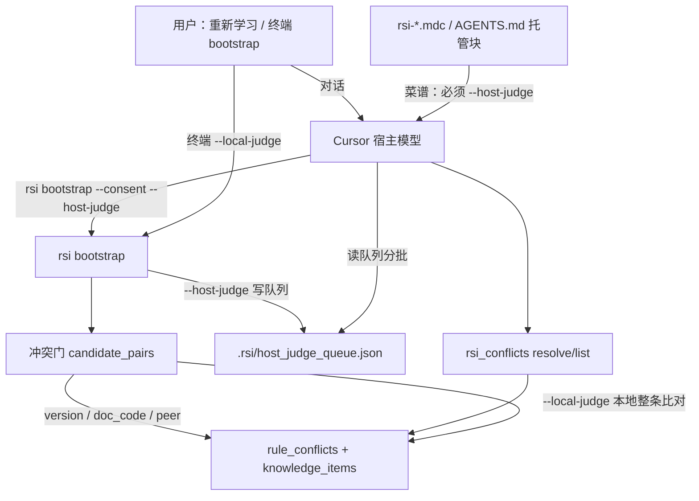
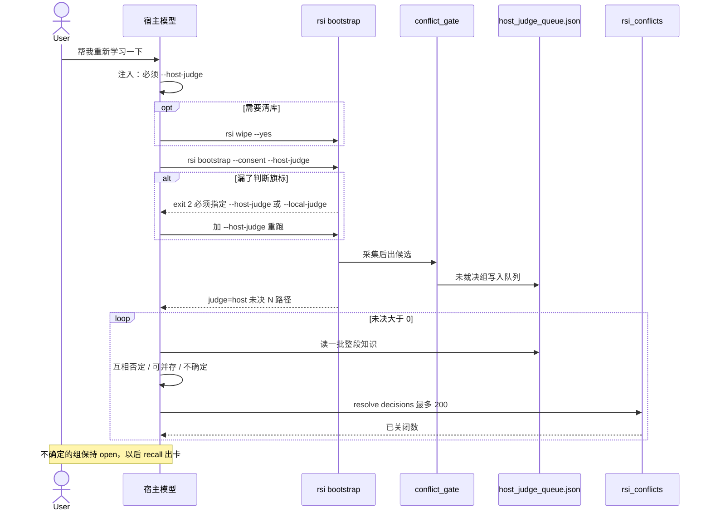
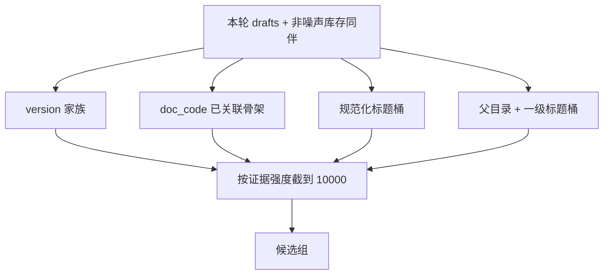
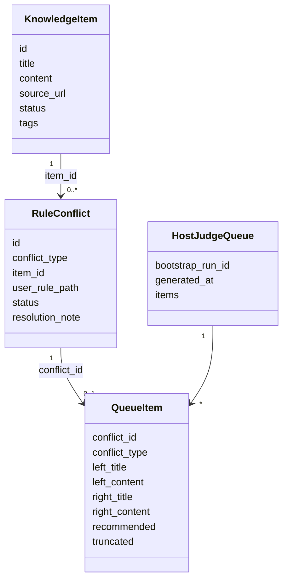
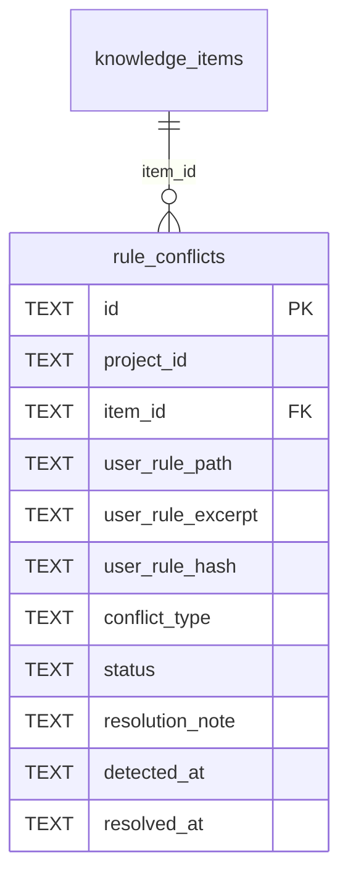

# 宿主判断 / 本地整条比对 — 冲突检测设计

> 日期：2026-09-13 | 状态：已定稿，待审阅  
> 范围：废除极性词笛卡尔积；`--host-judge` 与 `--local-judge` 双路径；工作包当场批处理  
> 取代：`2026-09-12-bootstrap-apply-and-confirm-design.md` §3 中 `incoherent` 的「共享 key phrase + 窗口极性相反」定义  
> 非目标：rsi 进程内调用任何 LLM API；新增 MCP 工具名；改召回融合算法；自动提升无 `bootstrap_run_id` 的 archived

---

## 1. 设计目标与定位

### 1.1 核心定位

冲突检测比较的是**两条完整知识是否互相否定**，不是「禁止 / 允许」标签，也不是共享某个词。

`rsi bootstrap` 是独立进程，调不到 Cursor 宿主模型。因此拆成两条入口：

- **对话里由 agent 学**：rsi 只出候选工作包；同一轮对话里宿主模型判断「是否真互相否定」，经现有 `rsi_conflicts` 写回。
- **用户自己敲 CLI**：rsi 用代码做整条知识比对（同一约束对象 + 命题是否互斥），不调模型。

用户说「帮我重新学习一下」时，不需要知道旗标。常驻注入把这句话译成带 `--host-judge` 的命令，并由 agent 循环吃完工作包。

### 1.2 设计原则

1. **进程不调模型。** 主链路保持零 Key。能做语义判断的是对话里的宿主，rsi 只读写工作包和库。
2. **比较整条知识。** 明文密码 vs 加密密码对象不同，不成对、不冲突。
3. **候选只在桶内产生。** 禁止全库两两比，禁止极性词叉乘。
4. **判断模式显式且互斥。** 对话漏旗标必须失败重跑，不能静默走本地；人类 CLI 必须显式 `--local-judge`。
5. **本轮尽量一次处理完。** 工作包上限 10000；agent 当场分批 resolve，不把大宗冲突推到「再学一轮」。
6. **宁缺毋滥只约束本地灰色区。** CLI 吃不准不当冲突；宿主标「不确定」的才留 recall 卡。
7. **不新增 MCP 工具名。** 批量裁决扩 `rsi_conflicts` 已有 `resolve` / `list`。

---

## 2. 功能架构

### 2.1 架构总览



### 2.2 模块职责矩阵

| 模块 | 职责 | 不做什么 |
|------|------|----------|
| `signal_discovery` / 采集 | 切片、排除目录、`--include` | 不判冲突 |
| `conflict_gate` | 桶内出候选；`--local-judge` 时对 `peer` 做对象互斥；`--host-judge` 时 `peer` 只入包不裁决 | 极性词倒排、笛卡尔积、调用模型 |
| `bootstrap_command` | 校验二选一旗标；写报告与 `host_judge_queue.json` | 猜是否在 agent 里 |
| `rsi_conflicts` | list 分页；resolve 单条或最多 200 条批量 | 新工具名、语义判断 |
| 注入 / recall 禁止项 | 把「重新学习」译成命令并要求当场吃完队列 | 让用户自己复制命令 |

---

## 3. 业务流程

### 3.1 业务流程图

对话路径（当场批处理）：



CLI 路径：用户执行 `rsi bootstrap --local-judge` → 采集 → 出候选 → 本地整条比对 → 写入 `rule_conflicts` / 直通。无队列循环。

### 3.2 业务节点简述

| 节点 | 输入 | 处理 | 输出 |
|------|------|------|------|
| 旗标校验 | argv | 两个判断旗标必须恰好一个；`--dry-run` 豁免 | 合法则继续；否则 exit 2 |
| 出候选 | 本轮 drafts（含过滤后的库内同伴） | 见 §4.1，上限 10000 | `ConflictDraft` 列表 |
| 本地裁决 | `--local-judge` + 候选 | version/doc_code 按文件证据扣留；peer 按对象互斥 | hold + 落库；灰色区不 hold |
| 写队列 | `--host-judge` + 候选 | version/doc_code 仍按文件证据 hold；peer **先不裁决** 只入包；队列含 run 内全部 open 冲突 | `.rsi/host_judge_queue.json` |
| 宿主批处理 | 队列未决组 | 模型只判语义；调用已有工具写回 | 未决为 0 或只剩 uncertain |
| 漏旗标重跑 | exit 2 文案 | 注入规定只许加 `--host-judge`，禁止改走 `--local-judge` | 第二次 bootstrap |

---

## 4. 核心设计

### 4.1 出候选（废除极性叉乘）

删除 `_polar_phrase_map`、`_iter_incoherent_pairs`，以及 `gate_drafts` 里 `drafts × peers` 全叉乘。日常提取 vs 历史条目走同一套分桶。

候选只在桶内产生：



| 类型 | 入桶条件 | 成对条件 | 扣留（本地） | `--host-judge` |
|------|----------|----------|--------------|----------------|
| `version` | DEPRECATED 链接或同目录 `vX.Y` | 标题相同且正文 Jaccard **&lt; 0.85** | 两侧 hold | 入包；文件证据已成立，模型主要确认留哪侧 |
| `doc_code` | 文档已关联到模块骨架 | 点名的类/函数骨架中不存在（仍过滤通用标识符） | 只 hold 文档 | 入包 |
| `incoherent`（语义为 peer） | **同一规范化标题**，或 **同一父目录 + 同一一级标题**（父目录以 `source_url` 相对路径计算；`auto-extract` 等无路径来源只进标题桶） | 来源不同，正文 Jaccard 在 **[0.35, 0.85)** | 见 §4.2 | **只入包，不裁决** |

类型名继续叫 `incoherent`，resolve 动词不变（`keep_item` / `keep_peer` / `coexist`），避免再拆一套枚举。

明文密码 vs 加密密码：标题与目录桶都对不上则**不成对**。

工作包硬顶 **10000**。截断顺序：先保 `version`、`doc_code`，再按 Jaccard 距 0.85 的距离（越不像复制越优先）收 `peer`。截断项写入报告「未入包」，**不视为已判**；提示收窄 `--include` 或分目录再学。这是保护，不是让用户把同一批再确认一遍。

### 4.2 `--local-judge` 整条比对

- `version` / `doc_code`：维持现有文件证据逻辑。
- `peer`：去掉语气词（禁止 / 不要 / 不得 / 避免 / 严禁 / 允许 / 推荐 / 优先 / never / don't / must not / always / prefer 等）后，比较**约束对象**（剩余连续词块）。
  - 对象相同，且一条禁止族、一条允许族 → 开冲突并两侧 hold。
  - 对象不同（明文密码 vs 加密密码）→ 不当冲突。
  - 吃不准 → **不当冲突**（宁缺毋滥）。
- 对象抽取是启发式：取**正文首个 `# ` 一级标题，否则条目标题**，去语气词后比较剩余词块；不做句法分析。对象粒度刻意停在标题级——本地路径只是兜底，「标题相同但首句对象不同」的细分交给 host 路径的模型判断；候选带宽（Jaccard [0.35, 0.85)）是本地路径的最后一道闸。

禁止再用「窗口里出现允许词 + 共享任意 ≥4 字」作为充分条件。

### 4.3 `--host-judge` 当场循环

rsi **不**在进程内等模型。写完队列即退出 0。

队列含**本 run 全部 open 冲突**（version / doc_code / peer），每组带：`conflict_id`、`conflict_type`、两侧完整 `title` + `content`（超过现有切片 `max_tokens` 则截断并标注 truncated）、`recommended`、`bootstrap_run_id`。version/doc_code 已按文件证据 hold，模型确认留哪侧；peer 未裁决。

Agent 同一轮：

1. 读队列或 `rsi_conflicts` `list`（带 `bootstrap_run_id`，分页）。
2. 每批几十到 200 组，只答：互相否定 / 可并存 / 不确定。
3. `resolve` 提交 `decisions`（≤200）。可并存 → `coexist`；互相否定 → `keep_item` 或 `keep_peer`（跟随包内 `recommended`，除非两侧正文明显应反过来）；不确定 → 不 resolve。
4. 重复直到未决为 0 或只剩 uncertain。

不确定组保持 `open`，走已有 recall 抉择卡（每次最多 1 张）。用户不必再说第二次「处理冲突」。

### 4.4 旗标与失败

| argv | 结果 |
|------|------|
| `--host-judge` | 写队列，peer 不本地裁决 |
| `--local-judge` | 本地整条比对；**删除**宿主队列文件（若有），避免 agent 误读旧 run |
| 都没有且非 `--dry-run` | exit 2：`必须指定 --host-judge 或 --local-judge` |
| 两个都有 | exit 2：`不能同时使用 --host-judge 与 --local-judge` |
| `--dry-run` | 不要求判断旗标 |

终端成功摘要必须含 `judge=host` 或 `judge=local`、候选组数、未决组数、队列路径（host 时）。

### 4.5 注入文案（扩现有抉择纪律）

写入 `targets.py` 常驻块（及等价 AGENTS 托管句），不新开工具：

- 用户说重新学习 / bootstrap → 你自己执行，不要把命令丢给用户。
- 对话里必须 `rsi bootstrap --consent --host-judge`；要清库先 `rsi wipe --yes`。
- 看到「必须指定 --host-judge 或 --local-judge」→ 加 `--host-judge` 重跑，不要改走 `--local-judge`。
- 学完读 `.rsi/host_judge_queue.json`（或 `rsi_conflicts` list 本 run），按批 ≤200 resolve，直到未决为 0。
- 只把「不确定」留给以后的 recall 卡。

### 4.6 错误与边界

- 队列文件写失败：bootstrap 仍 exit 非 0，库内冲突已落则报告写明「请用 rsi_conflicts list」。
- `--host-judge` 后 agent 未吃完队列：冲突保持 open，下次 `rsi_recall` 出卡；报告与终端已写明未决数。
- 批量 resolve 部分失败：返回每条 id 的成功/失败，已成功的不回滚。
- watch 增量学习：不跑 peer 全量门；跨文件冲突等下次 bootstrap。
- 旧库里极性叉乘留下的上万条 `incoherent`：**不自动清理**。清库重学走 `rsi wipe --yes`。
- `--include` / 噪声目录规则保持 2026-09-12 审查后的行为（嵌套 include 不打开兄弟目录）。

---

## 5. 数模设计

### 5.1 数据模型设计



`user_rule_path` 对知识对复用为对侧 `source_url`（与现网 version/doc_code/incoherent 写入方式一致）。不新增表。

`host_judge_queue.json` 示例：

```json
{
  "bootstrap_run_id": "uuid",
  "generated_at": "2026-09-13T00:00:00+00:00",
  "judge": "host",
  "capped": false,
  "omitted": 0,
  "items": [
    {
      "conflict_id": "…",
      "conflict_type": "incoherent",
      "left": {"title": "…", "content": "…", "source": "docs/a.md"},
      "right": {"title": "…", "content": "…", "source": "docs/b.md"},
      "recommended": "keep_peer",
      "recommended_reason": "…",
      "truncated": false
    }
  ]
}
```

### 5.2 表设计

无新表。沿用 `rule_conflicts`：



| 字段 | 类型 | 约束 | 说明 |
|------|------|------|------|
| id | TEXT | PK | 冲突 id |
| project_id | TEXT | NOT NULL | 工作区项目 |
| item_id | TEXT | FK knowledge_items | 一侧知识 |
| user_rule_path | TEXT | NOT NULL | 对侧 source_url 或用户规则路径 |
| user_rule_excerpt | TEXT | NOT NULL | 摘录；host 队列另存全文 |
| user_rule_hash | TEXT | NOT NULL | 对侧内容哈希，去重 |
| conflict_type | TEXT | NOT NULL | 含 version / doc_code / incoherent |
| status | TEXT | 默认 open | open 或已有裁决枚举 |
| resolution_note | TEXT | 可空 | 备注 |
| detected_at / resolved_at | TEXT | | ISO 时间 |

`list` 按 `bootstrap_run_id` 过滤：与 `knowledge_accept._conflicts_for_run` 同口径——JOIN 两侧 `knowledge_items.tags` 是否含 `bootstrap_run_id:<uuid>`（任一侧命中即算本 run）。**不改表、不加列**，不占用 `resolution_note`（persist 仍写 `recommended:…`；resolve 时 note 覆盖该前缀，与现网一致）。

---

## 6. 接口设计

本功能走 **CLI + 现有 MCP 工具**，不是 HTTP REST，不适用 das-rest 的路径/鉴权模型。本地单用户，无 API Key。

### 6.1 CLI `rsi bootstrap`

| 项 | 说明 |
|----|------|
| 新增参数 | `--host-judge`、`--local-judge`（store_true，互斥且非 dry-run 时必选其一） |
| 成功 | exit 0；stdout/报告含 `judge`、候选组数、未决、队列路径 |
| 旗标非法 | exit 2；stderr 固定句，供 agent 匹配重跑 |
| 队列 I/O 失败 | exit 1 |

### 6.2 MCP `rsi_conflicts`（工具名不变）

**list 增补参数（均可选）**

| 参数 | 类型 | 说明 |
|------|------|------|
| bootstrap_run_id | string | 只列本 run 工作包 |
| limit | integer | 默认 100，最大 200 |
| offset | integer | 分页 |

**resolve 增补参数**

| 参数 | 类型 | 说明 |
|------|------|------|
| decisions | array | `[{conflict_id, resolution, note?}]`；出现时忽略顶层单条 conflict_id |
| 单批上限 | | 200；超出返回 error，一条都不执行 |

单条 `conflict_id` + `resolution` 保持兼容。

`resolution` 对 version/doc_code/incoherent：`keep_item` / `keep_peer` / `coexist`。

成功：`{status: success, data: {resolved: [...], failed: [...]}}`。  
失败：`{status: error, message: …}`（与现网工具信封一致）。

### 6.3 工作包文件

路径：`<project>/.rsi/host_judge_queue.json`。  
`--local-judge` 删除此文件（若存在）。`--host-judge` 无未决时写 `items: []`。

---

## 7. 测试要点（实现时）

- 裸 `rsi bootstrap`（非 dry-run）exit 2。
- 双旗标 exit 2。
- 「禁止写入明文密码」vs「允许写入加密密码」不成对 / 不冲突。
- 同一对象一禁一许：`--local-judge` 开 incoherent。
- 极性共享词（如何使用 MySQL vs 禁止 eval）不再成对。
- `--host-judge` 对 peer 不改 status 为已裁决；队列含全文（version/doc_code 也在队列内）。
- `rsi_conflicts` `list` 按 `bootstrap_run_id` 只列本 run。
- `resolve` `decisions` 201 条被拒；200 条部分失败不回滚已成功。
- 嵌套 `--include` 不打开兄弟噪声目录（回归已有用例）。
- `--local-judge` 后 `host_judge_queue.json` 不存在。

---

## 8. 与既有设计的关系

`2026-09-12-bootstrap-apply-and-confirm-design.md` 的车道 A/B/C、切片、抉择卡、不自动提升 archived **仍然有效**。仅 §3 `incoherent` 定义改为本文件的 peer 分桶 + 双路径裁决。该稿「非目标：引入 LLM 做语义对错判断」改为：rsi 不调 LLM；宿主模型在对话里判断工作包。
