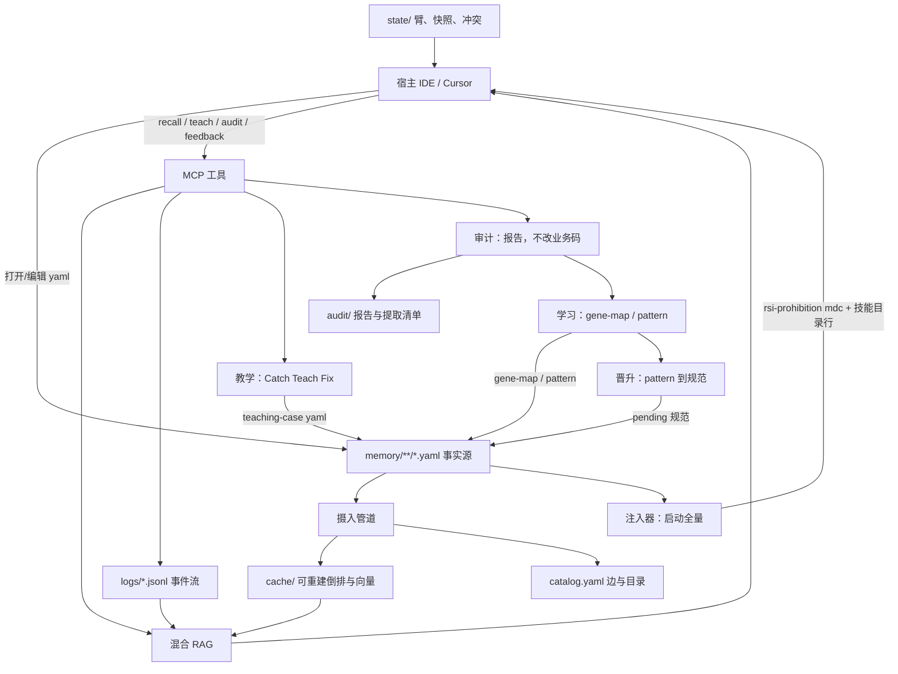
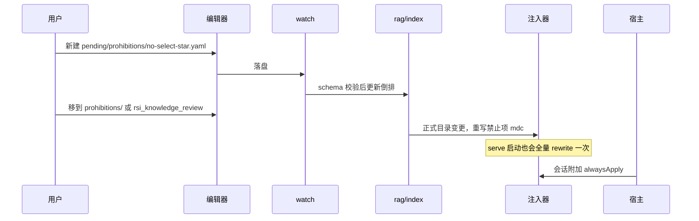
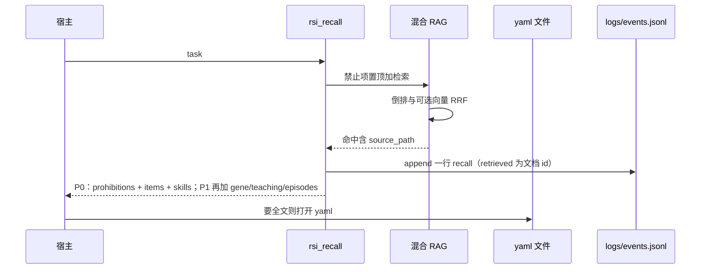
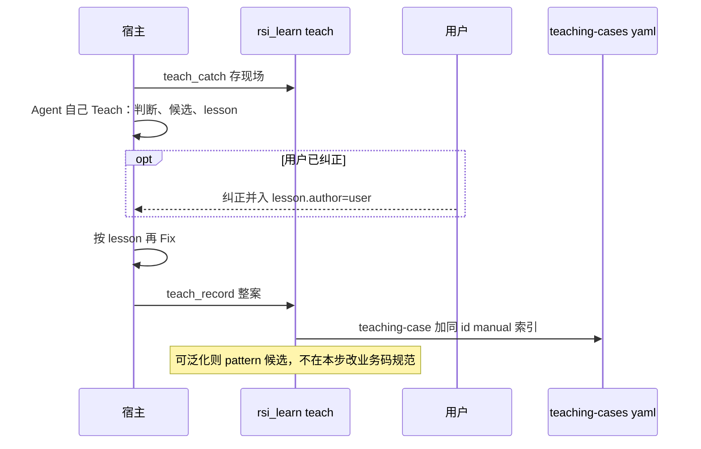
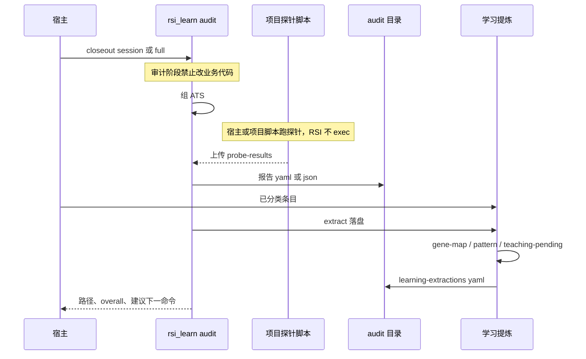
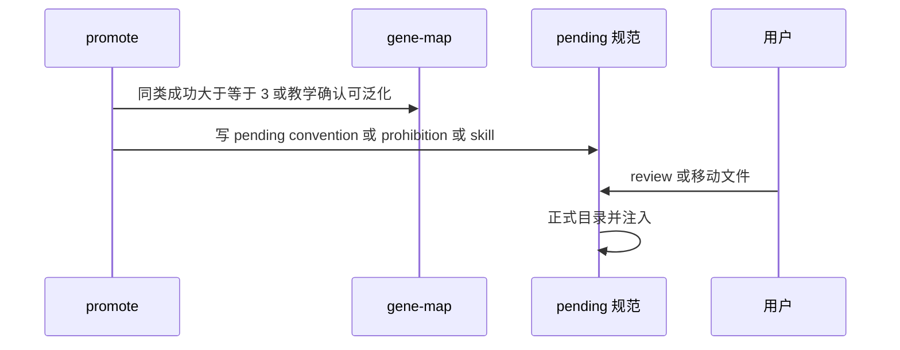
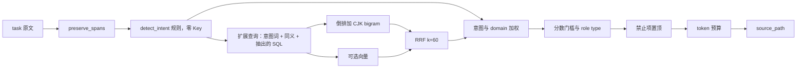
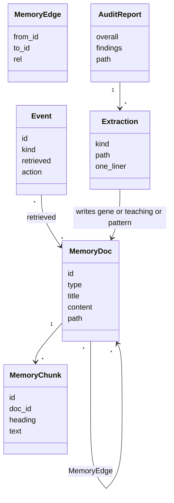

# 可读记忆层 + 混合 RAG + 知识/学习 DAG — 详细设计

> 日期：2026-09-13 | 状态：对照复审对齐（规格 + 计划）  
> 范围：记忆全部文件化；YAML 一条一档 + JSONL 流水；混合 RAG；学习 / 教学 / 审计 / 晋升  
> 本波边界：MCP stdio；零 Key 主链路；不自持 AgentLoop；不 exec 项目探针；规范晋升走 pending；运行时单 SoT  
> 参照：`calcite-avatica-gateway` 的 teaching / audit / gene-map 流程；字段去引擎特化；现网 `rsi serve` 热路径

---

## 1. 设计目标与定位

### 1.1 核心定位

RSI Boot 仍是**宿主模型的程序性记忆层**。工作区 `.rsi/` 里的结构化文本就是全部状态：人用编辑器打开、Git 对比；机器用同一套 schema 反序列化。

要对齐的是 calcite-avatica-gateway 那套**执行契约**（`.cursor/skills/gateway-parser-teaching`、`gateway-engine-audit`、`gateway-parser-gene-map`）：

| 契约 | 谁做 | 何时 | 落盘 |
|------|------|------|------|
| **学习** | 宿主 Agent 按 rubric 提炼，交给以后的 Agent | 修复成功、审计 closeout、可复用策略 | `gene-map/`、`patterns/`、`learning-extractions-*.yaml` |
| **教学** | 宿主 Agent 走 Steer：Catch → Teach → Fix | 修失败、低置信、将改公共规则、成功里出现可复用策略、用户纠正 | `teaching-cases/`（高权）+ `gene-map/manual/` |
| **审计** | 宿主 Agent 对照清单 | 改了业务代码的收工，或显式 audit | `.rsi/audit/` 报告；纪律上此阶段不改业务代码 |
| **晋升** | 宿主 Agent 提议，RSI 只写 pending | 同类成功 ≥3 或案例勾可泛化 | pattern → convention / prohibition / skill |

注入与召回是触达通道。Harness 提案与 Thompson 臂仅作召回调参，与教学、审计工序分开。

### 1.2 设计原则

| 原则 | 原因 |
|------|------|
| 零 SQLite | 去掉二进制库和迁移链；克隆仓库即可读全部记忆 |
| 一种记录一种格式 | 可变条目 ≠ 追加流水，不拿一种格式硬套全部 |
| Schema 先于散文 | 记忆是带字段的对象，`content` 只是其中一个字符串字段 |
| 生成物可扔掉 | 倒排/向量索引可全量重建，不进 Git |
| 零 Key 主链路 | 无 Embedding 时用意图规则 + 倒排 + CJK bigram，与今日 FTS 降级路径同级 |
| 意图匹配 | 用户/模型原文不标准。知识检索必须意图 + RAG，禁止把标题或签名精确相等当作命中条件 |
| 规范待审 | 晋升成规范才进 `pending/`；教学/gene 案例直写 |
| DAG 服务记忆 | 关系图给人看、给召回加权；管道是函数串，不是 Job 调度 |
| 教学是 Agent 工序 | 与收工学习一样：宿主自己写案例、自己再修；RSI 只落盘。用户纠正提高权重，不挡流程 |
| 审计只读业务树 | 审计阶段只写 `.rsi/`；修代码另开一轮 |
| 收工可审计 | 写了学习/教学就必须在最终总结列出路径；没写要写跳过原因 |
| 单 SoT | 运行时只认 `.rsi/` 文件树。不允许召回读文件、注入读表并行 |
| 通道目录独占 | 反馈提取、收工学习、晋升、审批各写各的目录，互不抢写 |

### 1.3 存储格式

运行时不用 SQLite。serve 启动把 YAML 载入内存建倒排，缓存进 `.rsi/cache/`（gitignore，可全量重建）。个人项目通常远小于 1 万条，与现网 CJK 进程内打分同量级。

| 格式 | 用途 |
|------|------|
| 一条一个 YAML | 知识 / 技能 / 禁止项 / 教学案例 / gene-map |
| 单个小 YAML | 召回臂、画像、边列表、rubric |
| JSONL | 只追加的日志、候选、向量 |
| JSON 缓存 | `cache/inverted.json` 等生成物 |

技能对内是 `skill.yaml`；若要对接技能市场，再渲染 SKILL.md 作为导出适配。

一条记忆示例：

```yaml
id: 7c2a9f1e2b4d4c0e9a11b0c3d4e5f678
type: prohibition
status: active          # 与所在目录冲突时，目录赢，回写本字段
title: 禁止 SELECT *
domain: database
tags: [sql, mysql]
roles: []
source: feedback
created_at: 2026-09-13T12:00:00Z
content: |
  查询必须显式列字段，禁止 SELECT *。
```

JSONL 流水一行：

```json
{"id":"…","ts":"2026-09-13T12:00:00Z","kind":"recall","task":"适配归档","retrieved":["7c2a9f1e…"],"arm":"recall-balanced"}
```

### 1.4 学习 / 教学 / 审计

契约通用，项目特有键放 `extra`。

环：

```text
开干前 rsi_recall：P0 = 禁止项 + items + 技能目录；P1 起加相似 gene-map / teaching / 情节
    ↓
干活（修代码 / 适配 / 调试）
    ↓ 修失败 / 低置信 / 可复用策略 / 或用户纠正
教学：Agent Catch → 自己 Teach（判断、候选、lesson）→ 按 lesson Fix → teach_record
      用户纠正时 lesson.author=user，weight=10，否则 weight=8
    ↓ 本轮改了业务代码
审计：组 ATS → 项目探针（RSI 不内置某仓脚本）→ checklist → 只写 .rsi/audit 报告
    ↓
学习：宿主按 rubric 分好类，RSI 写入 gene-map / pattern；出 learning-extractions-*.yaml
    ↓ 可泛化
晋升：pattern → pending convention/prohibition/skill（规范待审）
```

RSI 负责 schema、落盘、检索、MCP、注入收工纪律。宿主 Agent 按 skill 生成教学与收工分类结果，再交给 RSI。探针由宿主或项目脚本跑完后上传结果。

### 1.5 已定规则

| 项 | 规则 |
|----|------|
| 教学 | 宿主 Agent Catch → Teach → Fix → `teach_record`。用户纠正时 `author=user`、weight=10 |
| 生成边界 | lesson 与 rubric 分类由宿主 Agent 写；RSI 校验、写入、检索 |
| 审计纪律 | 注入段约束宿主在 `audit_finish` 前不改业务代码；RSI API 只写 `.rsi/` 与既有注入载体 |
| 探针 | 只收已跑完的 `probe_results` |
| 反馈提取 vs 收工学习 | 见 §2.3：反馈提取只写 pending 禁止项与约定；收工学习只写 gene / pattern / teaching |
| 审批分工 | `rsi_learn promote` 只写 pending；`rsi_knowledge_review` 只搬 pending ↔ 正式/archive |
| 注入范围 | alwaysApply 只禁止项；技能只挂 name+description；约定与文档不进 `rsi-*.mdc`；收工纪律块 P2 写入 AGENTS |
| 启动注入 | `rsi serve` 启动做一次全量 rewrite，再靠 watch / 知识变更 |
| retrieved | `events.jsonl.retrieved` 为文档 id 列表，不是 domain/tag |
| 类型映射 | migrate：`experience→convention`；`architecture`/`faq→documentation`（`extra.legacy_type` 保留原值） |
| 技能事实源 | 对内只认 `skill.yaml`；提案槽 migrate 后写 yaml |
| Watch | 只监 `.rsi/memory/**/*.yaml`；仓库文档扫描不进热路径 |
| 专用字段 | 进 `payload`；顶层仅 §4.2 白名单 |
| 双写 | teaching 与 gene-map/manual 同一 `id`；召回以 teaching 为准 |
| 闸门 | 案例直写；晋升成规范才进 `pending/` |
| 治理工具 | 一个 `rsi_learn`（teach / audit / extract / skip / promote）；`rsi_memory` 管索引 |
| 验收 | 测 closeout 清单与落盘一致；臂与提案本波只做 migrate |
| 晋升键 | 写侧计数用精确 `error_signature + failure_type`；**召回不靠这组键相等** |
| 检索 | 意图识别 + 查询扩展 + 倒排/向量 RAG；`open`/`review` 按 id 除外 |
| 情节召回 | `rsi_recall` 用同一套意图+RAG 扫 `events.jsonl`，不要求 task 字符串全等 |
| 技能披露 | 注入只挂 name+description；正文只经召回或打开 skill.yaml |
| 写盘脱敏 | redact-not-drop：去密钥/连接串，保留周围事实 |
| 热路径外模块 | `orchestrator/pipeline.py`、`rsi_query`、`SkillLoader.match` 不登记、不接线 |
| 语言 | 叙述跟文件/调用方；**不**把 SQL、代码、工具名、术语译成中文。见 §4.11 |
| 工作区 | 一个 `.rsi/`；`project_id=local`；传入的旧 project_id 忽略 |
| CLI 退出 | 0 成功 / 2 用法 / 3 业务 / 1 意外；serve 默认 WARNING |

### 1.6 与实现计划对齐（2026-09-13 对照复审）

- P0 召回形状以 §6.1 / §9 为准，不以 §1.4 目标环的「相似 gene/teaching」为准（那是 P1）。
- 教学对文件名与其它 YAML 一样是 `{slug}--{id8}.yaml`，不是 `manual/{id}.yaml`。
- 读接口名是 `MemoryStore.read`，不是 `get`。
- convention/prohibition 的口语/英文 paraphrase 验收在 **P0**；gene/teaching 返回体在 **P1**。
- 换芯日在计划 Task 11b；11a 只换冲突/统计/提案载体，不切 Runtime。

---

## 2. 系统架构

### 2.1 架构总览



没有 `rsi.db`。进程崩溃只可能丢掉未 flush 的一行 JSONL 或一次未完成的原子替换；YAML 用「写 `.tmp` + `os.replace`」。

### 2.2 模块职责矩阵

| 模块 | 职责 | 不做什么 |
|------|------|----------|
| `memory/store.py` | 读写单条 YAML；校验 schema；原子替换；维护目录约定 | 不调模型、不写 Markdown 知识 |
| `memory/logstore.py` | JSONL append / 按 id 扫描 / 滚动压缩 | 不改历史行（更正用新行 `supersedes`） |
| `memory/watch.py` | 监听 `memory/**/*.yaml`，防抖后刷新缓存 | 不扫源码树 |
| `memory/graph.py` | 读写 `catalog.yaml` 的 edges；导出 mermaid 文本 | 不做 Job 调度 |
| `rag/index.py` | 内存倒排 + 可选向量；落 `cache/` | 不引入 SQLite/FTS5 |
| `rag/chunker.py` | 按段落/`##` 风格小节切 `content`（纯文本规则，不是 MD 渲染） | 不改源 YAML |
| `rag/query.py` | 意图 + 原样片段抽出 + 查询扩展（同义/意图词） | 不把 `query == title` 当命中 |
| `rag/retriever.py` | 倒排打分 + 可选向量 + RRF + 意图/domain 加权 | 不生成答案；禁止精确标题短路 |
| `learning/pipeline.py` | **反馈提取**：rejected/modified → pending 禁止项/约定 | 无 Key 不调 LLM |
| `learning/gene_map.py` | 收工学习：校验并写入宿主已分类的 gene-map/pattern | 不分类、不写业务代码 |
| `learning/teaching.py` | 教学：收 Agent 写好的 teaching-case，镜像 manual 索引 | 不替 Agent 写 lesson |
| `learning/audit_store.py` | 审计：收 ATS/报告/已跑探针结果，写 `.rsi/audit` | **不 exec 探针、不改业务树** |
| `learning/promote.py` | 晋升：频次或人工 → pending 规范 | 不直写正式 prohibition |
| `scanner/*` | 摄入 DAG 采集 | 禁止再 INSERT 任何 SQL；不扫仓库 `.md` 进记忆热路径 |
| `injector/*` | 从正式目录 YAML 重写 mdc / AGENTS；serve 启动全量一次 | 本波不写 `rsi-convention-*.mdc` |
| `data/sqlite.py` | 仅 `rsi memory migrate` 只读旧库 | 运行时不打开、不持有连接 |
| `learning/skill_loader.py` | 本波不接线 | 不把 SKILL.md 当事实源 |

### 2.3 与现网接线

现网热路径已经是「召回 → 反馈 → 提取 → 审批 → 注入」。本方案换载体并补 `rsi_learn`，不另起一条环。**不允许双 SoT**：migrate 完成后 `Runtime` 不持有 sqlite 连接；召回、注入、冲突、提案、统计全部读文件。

| 环节 | 现网模块 | 新落点 | 接线规则 |
|------|----------|--------|----------|
| 召回 | `RecallService` + FTS5/CJK + `strategy_configs` + `interaction_logs` | 倒排扫 YAML；臂 `state/arms.yaml`；日志 `events.jsonl` | 形状保留。`retrieved` 改为文档 id（现网写的是 domain/tag，必须 remap） |
| 反馈 | `LogService` + `FeedbackWorker` | append `events.jsonl` | Worker 保留，落盘改文件 |
| 反馈提取 | 调度器 `KnowledgeExtractor.run_daily` | `learning/pipeline.py` → `pending/prohibitions/` 与 `pending/conventions/` | **只写这两个 pending 目录** + `candidates.jsonl` |
| 收工学习 | 无 | `rsi_learn extract` → gene-map / patterns / teaching-cases + `audit/learning-extractions-*.yaml` | **不写** pending 禁止项/约定 |
| 晋升 | 无独立入口 | `rsi_learn promote` → `pending/**` | 不直写正式目录 |
| 审批 | `rsi_knowledge_review` 改 `status` 列 | 同一工具，实现改为搬文件 | 只搬 pending ↔ 正式/`archive/`，不新建正文 |
| 注入 | `RuleInjector` 读 active `prohibition+convention+experience` | 读正式 `prohibitions/*.yaml` + 技能目录行；P2 再加收工纪律块 | 本波不产出 `rsi-convention-*.mdc`；首次 rewrite 后现网约定文件不再生成 |
| 教学/审计 | 无 | `rsi_learn` teach_* / audit_* | 全新接线；与提取调度器目录不重叠 |
| 提案/臂 | `ProposalEngine` + `SnapshotStore` + Thompson | `state/proposals/*.yaml`、`state/snapshots/`、`state/arms.yaml` | 与 `knowledge_items` **同一 migrate 批次**卸到文件，语义本波不动 |
| 冲突 | `conflict.py` 扫 `knowledge_items` | 扫正式/pending yaml + 用户规则 → `state/conflicts.yaml` | 查询条件随 `retrieved` 改 id |
| 台账 | `rule_artifacts` | `state/artifacts.yaml` | 同一批次 migrate |
| Watch | `IncrementalLearner` 扫仓库 `.md/.rst/.txt/.adoc` | `memory/watch.py` 只监 `.rsi/memory/**/*.yaml` | `--watch` 改绑 yaml；仓库文档扫描不并行写入记忆 |
| 技能 | `SkillLoader` 已构造、serve 未用；提案槽写 SKILL.md | `memory/skills/<name>/skill.yaml` | SKILL.md 仅导出命令生成 |
| 启动 | 只在知识/提案变更时 `rewrite` | serve / `--then-start` **启动全量 rewrite** | 否则手改 yaml 不会进 mdc |
| MCP | 9 工具，无 `rsi_learn` / `rsi_memory` | 现有 9 个 + 这两个 | 在 `mcp_server.py` 登记；信封不变 |
| 不接线 | `Pipeline` / `rsi_query` / `SkillLoader.match` / `prompt_renderer` | 保持磁盘存在即可 | 不登记、不从 Runtime 调用 |

**写入通道独占**（实现与验收都按此断言）：

| 写入者 | 允许写出 | 不得写出 |
|--------|----------|----------|
| 反馈提取（日更调度器） | `pending/prohibitions/`、`pending/conventions/`、`logs/candidates.jsonl` | gene-map、teaching-cases、`patterns/` 正式目录、任何正式规范目录 |
| `rsi_learn extract` | `gene-map/cases/`、`patterns/`、`teaching-cases/`、`audit/learning-extractions-*.yaml` | `pending/prohibitions/`、`pending/conventions/`、正式 prohibition/convention/skill |
| `rsi_learn promote` | 只写 `pending/prohibitions/`、`pending/conventions/`、`pending/skills/`（从已有 `patterns/` 或 teaching 提炼） | 正式目录；不写 `patterns/`（案例已由 extract/teach 直写） |
| `rsi_learn teach_record` | `teaching-cases/`、`gene-map/manual/`（同 id）；`promote_to_pattern=true` 时另写 `patterns/`（案例，不是规范） | `pending/prohibitions/`、`pending/conventions/`、正式 prohibition/convention |
| `rsi_knowledge_review` / 人手移动 | 搬 pending ↔ 正式 / `archive/` | 不新建正文、不改 type |
| `rsi_knowledge_add` | 规范类（prohibition/convention/skill）默认 `pending/`；documentation 与案例类直写对应正式目录 | 不写 audit、不写 events 以外的日志 |

换芯顺序（禁止交叉双写）：

1. `rsi memory migrate` 只读旧库，一次卸完知识 / 日志 / 臂 / 提案 / 冲突 / 台账 / 画像。
2. 将 `rsi.db*` 改名为 `.bak-*`。此后 serve **不再** `SQLiteClient.connect`。
3. 召回、注入、反馈、review、冲突、统计全部改读文件；启动全量注入。
4. 再挂 `rsi_learn` teach_record；extract / audit / promote 按 §7 分期。

---

## 3. 业务流程

### 3.1 业务流程图

**场景 A：用户手写禁止项**



**场景 B：召回**



**场景 C：教学 Catch → Teach → Fix**（对照 `gateway-parser-teaching`）



**场景 D：审计 + 学习**（对照 `gateway-engine-audit`）



**场景 E：晋升**



### 3.2 业务节点简述

| 节点 | 输入 | 输出 | 上下游 |
|------|------|------|--------|
| 手写/移动 yaml | 合法字段 | 磁盘文件 | 只认 `.rsi/memory` 约定目录 |
| schema 校验 | dict | MemoryDoc 或错误 | 失败写入 `logs/errors.jsonl`，不进倒排 |
| 刷新缓存 | MemoryDoc | 倒排 + 可选向量行 | 原子写 `cache/` |
| 混合检索 | task、role、臂 | 有序命中 + 路径 | 禁止项不受分数门槛 |
| 反馈 | token + action | events.jsonl 一行 | modified 相对上次 recall 的 excerpt；归因用 retrieved id |
| 草稿 | 仅反馈提取 | `pending/prohibitions/` 与 `pending/conventions/` | 收工学习不写这两个目录 |
| 教学 Catch | 失败/低置信/可复用/纠正 | 现场草稿 | Agent 继续 Teach |
| 教学落盘 | Agent 写的 lesson | teaching-case + manual 索引 | author=user 则 weight 10，否则 8 |
| 审计 | ATS + 探针结果 | `.rsi/audit/` | 不改业务代码 |
| 学习提炼 | findings + rubric | gene-map / pattern / extractions | 重复则引用已有 id |
| 晋升 | 频次或人工 | pending 规范 | 不直通正式禁止项 |
| 审批 | review 或移动文件 | 正式目录 | 只搬文件；触发注入 |
| 边 | 裁决/蒸馏/引用 | `catalog.yaml` edges | 召回带 1 跳邻居 |

---

## 4. 核心设计

### 4.1 目录约定

```
<workspace>/.rsi/
  memory/
    prohibitions/*.yaml
    conventions/*.yaml
    documentation/*.yaml
    skills/<name>/skill.yaml
    episodes/*.yaml
    gene-map/
      cases/                 # 自动学习，weight 默认 1
      manual/                # 教学写入，weight 默认 10
    teaching-cases/
      pending/               # Agent 自标低置信
    patterns/                # 可复用反模式 / 策略
    pending/
      prohibitions/
      conventions/
      skills/
    archive/
  audit/                     # 不进 memory 检索正文，只索引元数据
    <scope>/                 # session 或 full 或域 id
      ats-*.json
      probe-plan-*.json
      probe-results-*.json
      audit-*.yaml
      learning-extractions-*.yaml
  catalog.yaml
  logs/
    events.jsonl
    candidates.jsonl
    errors.jsonl
  state/
    arms.yaml
    profile.yaml
    proposals/*.yaml         # 可选：召回臂 Harness，非教学
    snapshots/<ver>/
    conflicts.yaml
    artifacts.yaml
    learning-rubric.yaml     # 项目可覆盖的分类表，缺省用内置
    terms.yaml               # 原样保留的术语（英文），可选
    teach-drafts/{id}.yaml   # teach_catch，不进召回
    audit-session.yaml       # 当前审计会话；finish 写 closed_at
  cache/                     # gitignore
    inverted.json
    vectors.jsonl            # 仅 enhance.embedding
    catalog.sha256
  identity.json
  manifest.json
  memory_migrate.yaml        # 旧库迁出记录
```

文件名：`{slug}--{id8}.yaml`。认领靠文件内 `id`，不靠文件名。

`status` 以目录为准，且**只认**这三组路径：`memory/pending/**` → pending_review；`memory/archive/**` → archived；其余 `memory/` 下正式目录 → active。与文件内字段冲突时目录赢，并回写 YAML。

`teaching-cases/pending/` **不是**规范待审：它是低置信案例子目录，status=active，召回降权（`payload.low_confidence=true`）。reject 审批结果：文件搬进 `archive/`，`extra.review=rejected`。

同 id 只允许一对：`teaching-cases/` 下一条 + `gene-map/manual/` 下一条。文件名一律 `{slug}--{id8}.yaml`，认领靠文件内 `id`，不靠 `manual/{id}.yaml`。`store.read(id)` 以 teaching-case 为准；manual 是投影（weight/source）。其他 type 全局唯一。

`catalog.yaml` 建议进 Git，方便人看边；与磁盘 YAML 不一致时以 YAML 文件集合为准，启动时重建边里指向失踪 id 的记录。

### 4.2 MemoryDoc schema（机器契约）

Pydantic 校验，未知顶层字段 **拒绝入库**（避免静默丢数据）。允许字段：

| 字段 | 类型 | 必填 |
|------|------|------|
| id | 32 hex | 是 |
| type | 见下行枚举 | 是 |
| title | str ≤ 120 | 是 |
| content | str ≤ 20000 | 是（skill 可用 `body` 别名，写入时归一成 content） |
| status | 枚举 | 否（目录覆盖） |
| domain | str \| null | 否 |
| tags / roles | str 列表 | 否，默认 [] |
| source | str | 否 |
| description | str | skill 必填（目录激活用） |
| created_at / updated_at | ISO8601 | 写入时补 |
| refs | id 列表 | 否；显式引用 |
| extra | 对象 | 否；项目特有键（如 engineId、sql） |
| payload | 对象 | type 专用字段只放这里，见 §4.10 |

`type` 枚举：`prohibition` / `convention` / `documentation` / `skill` / `episode` / `gene_case` / `teaching_case` / `pattern`。

现网 `content_type` 迁出映射（只在 migrate；运行时不接受未列出的 type）：

| 现网 content_type | 新 type | extra |
|-------------------|---------|-------|
| prohibition | prohibition | |
| convention | convention | |
| experience | convention | `legacy_type: experience` |
| documentation | documentation | |
| architecture | documentation | `legacy_type: architecture` |
| faq | documentation | `legacy_type: faq` |
| 已是 skill 的槽文件 | skill | 写入 `skills/<name>/skill.yaml` |

`bootstrap` 之后只写 prohibition / convention / documentation（及本波允许的案例 type），不再写 architecture / faq / experience。

未知**顶层**字段拒绝入库。`payload` / `extra` 内部键按 type 校验（教学/基因有必填子集），其余忽略不丢文件。

`content` 是纯文本。切片规则：空行分段；行首 `## ` 仅当作**可选小节标记**（三个字符前缀），不把文件当成 Markdown 文档来渲染。

### 4.3 三层记忆落盘

| 层 | 文件 | 触达 |
|----|------|------|
| 程序 | `prohibitions/*.yaml`、`skills/*/skill.yaml`、高权 `teaching-cases/` 与 `gene-map/manual/` | 禁止项 alwaysApply；技能只注入 name+description；正文与教学/基因按需召回 |
| 语义 | `conventions/`、`documentation/` | **只走 recall**；本波不写约定规则文件 |
| 情节 | `logs/events.jsonl` 为权威；过门槛才物化 `episodes/*.yaml` | recall 直接扫 JSONL（情境指纹），物化只为给人打开 |

情节物化门槛：同一 task 指纹反馈 ≥ 2，或 rating ≥ 4，或 rejected+评语。

### 4.4 意图 + 无库混合 RAG

用户话、模型草稿、报错摘录都**不标准**：口误、中英混杂、缺关键字、SQL 换了别名。检索主路径是 **意图识别 → 查询扩展 → RAG**。禁止这些当唯一命中条件：

- `task == title` / `task in content`
- `error_signature` 与原文全等（那是晋升/写时去重的键，不是召回键）
- 只比较 `id` 以外的单个字段精确相等

按 id 打开（`rsi_memory open`、review 指定 id）仍精确，那是认领不是检索。



零 Key：复用现网 `preprocessor/intent_classifier.detect_intent`（规则，不调模型）。意图只用于扩展词袋和加权，不单独决定返回哪一条。有 `enhance.embedding` 时向量通道补语义；失败则该切片只走倒排。

| 项 | 零 Key | 有 embedding |
|----|--------|----------------|
| 意图 | 规则 `detect_intent`；失败则 `general_assist` | 可选 LLM 意图，失败回规则 |
| 扩展 | 意图名、domain 提示词、同义表（`state/terms.yaml` 可作同义） | 同左 |
| 切片 | 段 / 可选 `## ` 小节，超 800 字再切（P1） | 同左 |
| 关键词 | 扩展后的词袋：英文按词；CJK bigram；IDF | 同左 |
| 向量 | 无 | `cache/vectors.jsonl` |
| 融合 | 倒排 + 意图加权 | RRF + 意图加权；cosine ≥ 0.6 或倒排归一化 ≥ 0.6 |
| 验收 | 口语/同义必须能命中；实现里不得出现 `title == task` | 同左 |
| 规模 | 1 万条以内启动 < 2s | 同左 |

规则文件只含：全部正式目录禁止项（alwaysApply）→ AGENTS 技能目录行（name+description+path）。收工纪律块（teach/audit/closeout，≤800 字）P2 写入同一托管块。约定与文档不进 `rsi-*.mdc`；采纳率只用于召回排序。禁止项超 32KB 时按最近采纳裁；**无采纳数据时按 `updated_at` DESC**，不得无序丢掉最新。首次按本方案 rewrite 后，现网留下的 `rsi-convention-*.mdc` 不再生成（全量幂等，台账标 removed）。

检索分期：P0 对整篇 `title+content` 建倒排（不切片）；P1 才按段 / `## ` 切片 + 可选向量 RRF。P0 的 `rsi_recall` 返回禁止项 + `items`（convention/documentation）+ 技能目录行；`gene_cases` / `teaching_cases` / `episodes` P1 才进返回体（P0 可落盘，召回下期才用）。

### 4.5 关系图 + 三条管道（仍不是 Job DAG）

边记在 `catalog.yaml`：

```yaml
edges:
  - {from: idA, to: idB, rel: supersedes}
  - {from: idC, to: idD, rel: conflicts, extra: {conflict_id: "…"}}
```

rel：`supersedes` / `conflicts` / `cites` / `distilled_from` / `implements`。`cites` 只认 YAML `refs:`，不解析 Markdown 链接。`rsi memory graph` 把边渲染成 mermaid **文本**（工具返回），不落 Markdown 知识文件。

三条管道都是函数串，调度器用现有 asyncio 定时即可。

**摄入**：用户规则与显式导入 → 候选 convention/documentation → 规范待审，或原文 allowlist 直通。仓库 `.md` 扫描（现网 `IncrementalLearner`）不进入 serve 热路径；需要时另开导入命令，仍走本闸门。

**反馈提取**：

```text
events.jsonl → 规则式提取（v3.0 §4.4）→ candidates.jsonl
  → 标题去重 → 冲突粗检 → pending/prohibitions 或 conventions
  → catalog 加 distilled_from
```

无 Key 不调 LLM。禁止项草稿不得原文直通。技能草稿只来自晋升或人手。

收工学习 / 教学 / 审计 / 晋升见 §4.10。反馈提取出禁止项/约定草稿；教学由 Agent 写 lesson 并再修；收工学习由宿主按 rubric 分类后交给 RSI。工具返回 closeout 清单，注入段要求最终总结照列。

### 4.6 写入闸门

闸门按写入对象命名：

| 闸门 | 行为 | 默认 |
|------|------|------|
| dry-run | 不写盘 | `--dry-run` |
| 案例直写 | 教学案例、gene-map、pattern 写入正式案例目录 | 案例默认 |
| 规范待审 | 晋升成 prohibition/convention/skill 必须进 `pending/` | 规范默认；禁止项锁定 |
| 原文直通 | allowlist 写入正式 `conventions/` 或 `documentation/` | 仅 CLI `rsi memory import` / bootstrap allowlist；MCP `add` 规范类仍进 pending |

### 4.7 并发与原子写

- 进程内一把 `asyncio.Lock` 覆盖「改 YAML / 改 catalog / 刷新 cache」。
- YAML、catalog、state：写入 `path.tmp` → `os.replace(path)`。
- JSONL：`O_APPEND` + flush；需要改历史时 **append 更正行**（`op: retract, ref: old_id`），不中划线改。
- `events.jsonl` 超 50MB 滚到 `events-YYYYMM.jsonl`，检索仍扫最近两个文件 + 物化 episodes。
- MCP 与 CLI 同时写：后写者 replace 赢；watch 以 mtime+hash 为准。个人工具不引入文件锁服务。

### 4.8 旧库迁出

`rsi memory migrate`（幂等）。**一次卸完**下列对象，禁止「知识已在 yaml、提案还在 sqlite」的半切：

1. 若存在 `.rsi/rsi.db` 或遗留 `~/.rsi/rsi.db`（先按现有 adopt 规则进项目），只读导出。
2. `knowledge_items` → 对应 YAML（type 按 §4.2 表映射；`status` 按目录：pending_review → `pending/`，active → 正式，其余 → `archive/`）。
3. `interaction_logs` → `logs/events.jsonl`。`retrieved` 尽量映射到新文档 id；映射失败写入 `retrieved_legacy_tags`（domain/tag 原值），**新写入不再使用该字段**。
4. `strategy_configs` **全部**行 → `state/arms.yaml`（按 intent+name）。本波召回只读 intent=recall 的臂；其余行保留，不参与 `rsi_recall`。
5. `rule_conflicts` → `state/conflicts.yaml`；`harness_proposals` + `config_snapshots` → `state/proposals/` 与 `state/snapshots/`；`user_profiles` → `state/profile.yaml`（本机单用户一份）；`rule_artifacts` → `state/artifacts.yaml`；`extraction_candidates` → `logs/candidates.jsonl`；`project_configs` → `manifest.json` / `identity.json`（沿用现网键）。
6. 提案槽里的 SKILL.md 转为 `memory/skills/<name>/skill.yaml`（正文进 content，frontmatter 进 description/tags）。本波不做 SKILL.md 导出命令。
7. bootstrap 未决若仍在 `host_judge_queue.json`，写入 `state/conflicts.yaml` 后可不再依赖该 json；注入文案改为 `rsi_conflicts`。
8. 写 `memory_migrate.yaml`（各表计数、源库路径、完成时间、未映射 retrieved 条数）。
9. 将 `rsi.db*` 改名为 `rsi.db.bak-*`。
10. 运行时只通过 migrate **调用** `connect`。serve / `--then-start` 不得调用 `SQLiteClient.connect`（允许模块存在于磁盘）。

P0 后运行时可不依赖 aiosqlite（migrate 用可选 extra 或标准库 sqlite3）。

### 4.9 安全

写盘前脱敏（redact-not-drop）：去掉连接串、密码、密钥，保留周围事实。schema 只用 `safe_load`。符号链接指出工作区则跳过。注入前走黑名单。教学/审计正文同一套规则。

### 4.10 学习 / 教学 / 审计 / 晋升

对照 gateway 三份 skill 的**流程**，字段去方言化。

**教学（`rsi_learn` action=teach_*）— Agent 自己 Catch → Teach → Fix**

对照 `gateway-parser-teaching`：工序在宿主 Agent。

触发（注入纪律列出，Agent 自判）：修失败多次；自报低置信；将改公共规则/多样本；成功里出现可复用脚本或归因；**以及**用户纠正执行/验证方式。

1. **Catch** `teach_catch`：Agent 提交 trigger + `system_attempts`，RSI 把草稿写到 `state/teach-drafts/{id}.yaml`（不进召回）。返回 id。
2. **Teach**：Agent **自己**写出判断、待确认点、候选修法，并填 `payload.lesson`（`author=agent`）。若用户已纠正，把纠正写入 lesson 且 `author=user`。RSI 不生成这段文字。
3. **Fix**：Agent 用刚写出的 lesson 再修或复验。
4. **Record** `teach_record`：`lesson.correct_fix` 非空即可落盘。Agent 自标低置信则路径为 `teaching-cases/pending/`。成功后删除或标记对应 teach-draft。
5. 同 id 写 `gene-map/manual/` 投影。`author=user` 时 `weight=10`，否则 `weight=8`（仍高于自动 gene-map 的 1）。召回 teaching 命中后不重复列出该 manual 行。
6. `promote_to_pattern=true` 另写正式 `patterns/`（案例直写），不写 pending 规范、不调用注入。

```yaml
id: …
type: teaching_case
title: …
content: |
  可复用结论
payload:
  scenario_type: repair | audit | execution
  trigger: {error_signature: "", failure_type: "", fingerprint: ""}
  system_attempts: [{attempt: "", result: "", validation: ""}]
  lesson:
    author: agent          # 或 user
    correct_fix: ""        # Agent 写的做法，或用户纠正
    reason: ""
    applies_to: []
    tags: []
    open_questions: []     # 可选
  fix_and_learn:
    applied: false
    validation: ""
    gene_map_weight: 8
    promote_to_pattern: false
extra: {}
```

**审计（`rsi_learn` action=audit_*）— 纪律隔离**

| 项 | 规定 |
|----|------|
| 范围 | `session` 或 `full`（须 scope_id） |
| ATS | 宿主传入 `changed_files` 或 glob 清单，RSI 只落 `ats-*.json` |
| 探针 | **只收**宿主上传的 `probe_results`。不 exec、不读 argv 配置跑命令 |
| checklist | 可选 `.rsi/state/audit-checklist.yaml`；无则 findings 以探针+宿主传入为准 |
| 落盘 | `.rsi/audit/<scope>/` |
| 纪律 | 注入段写明：未 `audit_finish` 前宿主不得改业务代码。RSI **不能**拦住 Write 工具。用户说「审计并修复」→ 先 report+extract → finish → 再修 |

报告最小字段：`scope`、`overall`（pass/fail）、`findings[]`（severity + path + note）、`probe_summary`、`disclaimer_partial`。session 且 pass 必须 `disclaimer_partial: true`。`audit_report` 只写报告；`audit_finish` 才结束审计会话（写 `state/audit-session.yaml` 的 closed_at）。

**收工学习（`rsi_learn` action=extract）**

Rubric 文件给**宿主**读（注入或 `rsi_learn action=rubric` 返回原文）。宿主产出已分类条目数组，RSI 按 `kind` 写入对应目录并查重（同 `error_signature`+`failure_type` 则只引用 id）。

| 宿主给出的 kind | RSI 写入 |
|-----------------|----------|
| pattern | `patterns/` |
| gene | `gene-map/cases/` |
| teaching | `teaching-cases/`（纠正标准时必有） |
| teaching_pending | `teaching-cases/pending/` |
| skip_dup | 不写正文，清单里引用旧 id |

写 `learning-extractions-<scope>-<ts>.yaml`。工具返回 closeout 清单（kind/path/one_liner）。注入段：最终总结必须照抄该清单或写 skip 原因。

**gene-map `payload`**

```yaml
payload:
  weight: 1
  source: automatic | manual
  scenario_type: ""
  failure_type: ""
  error_signature: ""
  fingerprint: ""
  solution_type: rule | ai | manual-teaching
  solution: ""
  validation: passed | failed | skipped
  scope: project | domain
```

相似检索（召回）：与 §4.4 同一条意图+RAG，对 teaching/gene 的 `content`+`payload` 建索引。精确 `error_signature + failure_type` **只用于** extract 去重引用和 promote 计数，不作为「找不到就不召回」的闸。`rsi_recall` 禁止项之后插 teaching（与 manual 去重）。

**晋升（`rsi_learn` action=promote）**

- 候选：精确键成功 ≥ 3，或 teaching 勾了 promote。源是已有 `patterns/` 或 teaching-case。
- 只写 `pending/prohibitions/`、`pending/conventions/`、`pending/skills/`。不写 `patterns/`。
- skill 获准时搬到 `memory/skills/<name>/skill.yaml`（`name` 来自 payload.name 或 slug(title)）。
- `scope=domain` 不得升全局 prohibition，除非 teaching 显式 `applies_to` 含全局。
- 晋升只写 pending 规范文件，**不**改 status、不调用注入。转正式只走 `rsi_knowledge_review` 或人手移动（§2.3 审批行）。

**注入纪律**

alwaysApply 只放正式目录 prohibition。技能目录行（name+description+path）进 AGENTS.md（P0）。收工纪律块（何时 teach_catch/record、何时 audit_*、收工照抄 closeout 清单，≤800 字）P2 写入同一托管块。约定不进规则文件。

触发：`rsi serve` / `--then-start` 启动全量一次；之后 `memory/watch` 看到正式目录变更、以及 review / add（禁止项获准）/ 删除时再 rewrite。

`rsi_review` 与召回臂本波只做 migrate，语义保持现状。实现必须与知识同一批次卸到 `state/`，不能继续打开 sqlite。

### 4.11 语言：叙述可本地化，符号与术语保持英文

「文件保持中文，交互跟调用方走」只约束**叙述句**（人话说明、进度、错误、hint）。它**不是**「整份文件都改成中文」或「只对 SELECT 开绿灯」。

三层：

| 层 | 语言 | 例子 |
|----|------|------|
| 叙述 | 文件里用中文写说明；CLI/MCP 的包装句按调用方 zh/en | 「查询必须列出列名」「Migration complete」 |
| 原样片段 | **始终英文（或原文）**，写入、召回、注入、本地化包装都不得改写 | `SELECT * FROM table`、`rsi_recall`、`pending/`、`error_signature`、`alwaysApply` |
| 结构键 | schema / JSON 字段名 / 工具 action / path | `content_type`、`teach_record`、`.rsi/memory/…` |

**原样片段**（可追加，不限于 SQL）：

- 代码与查询：SQL、正则、命令行、配置键、文件路径、URL
- 产品与协议名：MCP 工具名、Cursor/Git 术语、HTTP 方法
- 本系统词：`prohibition`、`pending`、`feedback_token`、闸门名
- 项目术语：引擎名、表名、API 名、错误码；可写在 `.rsi/state/terms.yaml`（一词一行，migrate/手写均可）

写入知识时：中文叙述 + 英文原样片段。正确：`禁止 SELECT *，必须写列名。` 错误：`禁止选择星号` 或把 `SELECT *` 译进 en 包装句里变成别的汉字。

`t(key, lang, **kwargs)` 只翻译模板；`{sql}` `{path}` `{tool}` `{term}` 原样代入。禁止项 mdc 正文按磁盘原文注入（含其中的 SQL/术语）。

| 表面 | 叙述怎么定 |
|------|------------|
| 记忆文件与禁止项正文 | 叙述保持作者语言（本仓库为中文）；原样片段不改 |
| MCP `list_tools`、instructions | 中英并列各一套**叙述**；工具名与路径只出现一次、不译 |
| MCP `message` / `hint` / 错误句 | 叙述跟请求语言；嵌入的代码/术语/工具名原样 |
| CLI 进度、help、stderr | `--lang zh\|en\|auto`；阶段名可本地化，`rsi.db`、路径、子命令名原样 |
| AGENTS 收工纪律块 | 中英各一段叙述（合计 ≤800）；工具名不重复翻译 |

探测（零 Key）：先抽出原样片段（反引号、全大写词、`SELECT`/`FROM`/`WHERE` 等、`rsi_*`、路径），再对剩余文本数汉字。顺序：`explicit` → `han >= 2` 则 `zh` → 有字母则 `en` → 进程上次 MCP/CLI 探测 → OS locale → `en`。`「修一下 SELECT *」` 去掉 SQL 后仍有「修一下」→ `zh`。

实现：`ux/lang.py`（`detect_lang`、`preserve_spans`）；`ux/terms.py`（内置词 + 合并 `state/terms.yaml`）；`ux/messages.py` 的 `t()`。工具函数禁止手写散句。

---

## 5. 数模设计

### 5.1 数据模型



权威：`MemoryDoc` 在 YAML；`Event` 在 JSONL；`AuditReport` / `Extraction` 在 `.rsi/audit/`；`MemoryEdge` 在 `catalog.yaml`；`MemoryChunk` 只在内存和 `cache/`。

### 5.2 文件模式（替代表设计）

无运行时表。记录形状如下。

**MemoryDoc（单文件 YAML）** — 字段见 §4.2。

**Event（JSONL 一行）**

| 字段 | 类型 | 说明 |
|------|------|------|
| id | str | |
| ts | ISO8601 | |
| kind | recall / feedback / retract / teach / audit / learn | |
| task | str | recall 时 |
| retrieved | str[] | 文档 id（新写入必填此语义） |
| retrieved_legacy_tags | str[] | 仅 migrate 回填；召回/冲突实现可读，新行不写 |
| excerpt | str | 命中标题拼接，供 modified diff |
| action / rating / comment | 可选 | feedback |
| token | str | feedback_token |
| arm | str | 召回臂名 |
| latency_ms | int | |

**Candidate（JSONL）**：id、ts、type、question、answer、source_event_id、status。

**Edge（catalog.yaml 列表项）**：from、to、rel、extra?。

**Arm（state/arms.yaml）**：name、top_n、threshold、alpha、beta、exposure、active。

**AuditReport / Extraction**：见 §4.10。

**Conflict（state/conflicts.yaml）**：id、item_id、user_rule_path、excerpt、type、status。

不画 ER 图：没有外键引擎；引用完整性由启动校验（边的端点必须存在或标 broken）。

---

## 6. 接口设计

MCP stdio，信封不变。不新开 REST。工具 `description` 中英并列；返回 `message` 按 §4.11 匹配 zh/en。可选入参 `lang`：`zh` | `en`（显式覆盖探测）。

### 6.1 `rsi_recall`

入参不变。P0 返回：`prohibitions`、`items`（convention/documentation）、`skills[]`（仅 name/description/path）。P1 起增加 `episodes[]`（来自 events.jsonl，可带已物化 path）、`gene_cases[]`、`teaching_cases[]`（相似失败优先，与 manual 去重）。命中含 `id`、`source_path`；P0 的 `heading` 可空（整篇、无切片），`weight` / `conflict_open` 有则填。`feedback_token` 仍签发。对应 `events.jsonl` 行的 `retrieved` 必须是这些命中的 `id`；不得再写入 domain/tag。口语/英文 paraphrase 命中正式 prohibition/convention 是 **P0** 验收（例：「别把所有列一次查出来」与 `don't select star` → 「禁止 SELECT *」）。同一句话打中 gene/teaching 返回体是 **P1**。

### 6.2 知识工具

`add` 写 YAML；`search` 走 RAG；`delete` 移到 `archive/`；`review` **只搬文件**（pending ↔ 正式/`archive/`），不新建正文、不改 type。reject → `archive/` 且 `extra.review=rejected`。`type` 可含 gene_case / teaching_case / pattern。prohibition / convention / skill 默认进对应 `pending/`；documentation 与案例类直写正式目录。skill 获准目标路径为 `skills/<name>/skill.yaml`。

### 6.3 `rsi_learn`（教学 / 审计 / 收工学习 / 晋升）

教学、审计、收工学习、晋升共用此工具。P0 只实现 `teach_catch` / `teach_record` / `skip` / `rubric`；P1 加 `audit_*` / `extract`；P2 加 `promote`。未到期的 action 返回明确错误且不写盘。工具在 P0 一并登记。

| action | 作用 |
|--------|------|
| teach_catch | 草稿写入 `state/teach-drafts/{id}.yaml`，返回 id |
| teach_record | Agent（或用户纠正）的 lesson 落盘 + manual 投影；可选直写 `patterns/` |
| audit_start | 写 ATS，打开审计会话 |
| audit_probes | 只收已跑结果 |
| audit_report | 写 audit-*.yaml（宿主传入 findings/overall） |
| audit_finish | 关闭会话（写 closed_at）；未 finish 则纪律仍有效 |
| extract | 收已分类条目，落盘并回 closeout 清单 |
| promote | 从 pattern/teaching 提炼 pending 规范（不含 patterns/ 本身） |
| skip | 记跳过原因（`logs/events.jsonl` kind=learn） |
| rubric | 只读返回当前分类表，供宿主执行 |

### 6.4 `rsi_memory` 与其余

`rsi_memory`：P0 实现 `index` / `open` / `reindex`；`graph` P2（边在 P2）。`rsi_feedback` 仍做反馈提取（过门槛只进 pending 禁止项/约定）。`rsi_conflicts` 带 path，按 yaml + `retrieved` id 扫描。`rsi_review` / 臂本波只迁文件、不改语义。`rsi_stats`：触达、gene/teaching 条数、审计份数、晋升数、skip 数。

`memory/watch` 只监 `memory/**/*.yaml`。`catalog.yaml` 与 `state/` 由写入 API 在同一把锁里更新，不靠 watch。

`mcp_server.list_tools` 登记现有 9 个工具 + `rsi_learn` + `rsi_memory`。不登记 `rsi_query`。`Runtime` 不持有 `pipeline` / `skill_loader.match`。

### 6.5 CLI

`rsi memory migrate` | `reindex` | `index` | `open` | `graph`；`rsi learn <action>` 与 MCP 同语义；`rsi bootstrap` 终点改为写 YAML。`--lang zh|en|auto`。退出码：0 成功、2 用法、3 业务（无库/找不到 id）、1 未捕获异常。`rsi serve` 默认日志 WARNING（Cursor 把 INFO 标成错误）。

---

## 7. 分期与验收

| 期 | 内容 | 验收 |
|----|------|------|
| P0 | YAML SoT、JSONL、一次卸完所有 sqlite 表、serve 零连接、启动注入、倒排、`retrieved` 写文档 id、`--watch` 只监 yaml、`rsi_learn` teach_record | 手写 prohibition 进 mdc；启动后无 `rsi-convention-*.mdc`；teach_record 写出 teaching-case + 同 id `{slug}--{id8}` manual；测试 spy 断言 serve 不构造/`connect` sqlite；召回日志 `retrieved` 为 id；「别把所有列一次查出来」与 `don't select star` 能命中「禁止 SELECT *」（convention/prohibition，不靠标题全等） |
| P1 | 切片 RAG、口语/同义能召回 gene/teaching、情节意图匹配、audit_*、extract 清单 | 同一口语/英文也能出现在 `gene_cases` / `teaching_cases`；extract **不**写 pending 规范；清单与磁盘一致 |
| P2 | 晋升精确键、收工注入段、边、`rsi_memory graph`、可选 import `.cursor/knowledge` | 3 条精确键成功出 pending convention/prohibition/skill；review **或人手移动** 才能把 pending 变正式；注入块含 teach/audit/closeout |

可测标准：

- 正式目录每条 MemoryDoc 都能被 `index` 到；`catalog.yaml` 允许含 pending id（`distilled_from`）。
- 删掉 `cache/` 后 `reindex`，无向量 Top5 重合 ≥ 80%。
- 仓库内无运行时 sqlite 连接（测试 spy）；migrate 是唯一读旧 `.db` 的入口。
- pending yaml 移入 `prohibitions/` 后出现对应 mdc；`conventions/` 下有文件也不生成 `rsi-convention-*.mdc`。
- serve 启动后即使没有任何知识变更，禁止项 mdc 已与正式目录一致。
- `--watch` 不扫描仓库 `.md`；改 yaml 才刷新缓存。
- 反馈提取与 `rsi_learn extract` 的写出目录按 §2.3 互斥（测试断言路径前缀）。
- 治理入口是 `rsi_learn`；探针只收上传结果。
- RSI 各写入 API 的路径前缀只允许 `.rsi/` 与既有注入载体（`rsi-*.mdc`、AGENTS 托管块）。
- `implicit_tracker` / `conflict.py` / 提案挖掘按 `retrieved` id 归因；仅 migrate 行可读 `retrieved_legacy_tags`。

---

## 8. 风险与回退

| 风险 | 应对 |
|------|------|
| 半切双 SoT | 知识/提案/臂/冲突同一 migrate；serve 不 connect；验收 spy |
| 手改坏 YAML | errors.jsonl；serve 不崩 |
| 检索弱于原 FTS5 | 倒排+IDF+CJK；1 万条启动 < 2s |
| JSONL 半行损坏 | 读时跳过坏行并记 error，其余行继续有效 |
| 并发覆盖 | 原子 replace + 单锁 |
| 技能市场要 SKILL.md | 导出适配器，存储仍是 skill.yaml |
| 迁移漏 | migrate 计数；`.bak` 保留一版 |
| 现网约定 mdc 消失 | 预期行为；约定改走 recall。验收断言不再生成 |
| 仓库文档扫描与 yaml watch 并行 | `--watch` 只绑 yaml；IncrementalLearner 不进 serve |
| 两套学习抢写规范 | §2.3 目录独占；测试断言路径 |
| 审计阶段改业务代码 | 注入纪律 |
| 学习写了但总结未列路径 | 注入纪律 + 工具返回 closeout 清单 |

回退：停在 migrate 前，继续用迁出前的二进制。事实源只有文件树。

---

## 9. 规范自检

- 知识是 YAML 对象；JSONL 只用于追加流。
- SQLite 仅出现在 migrate 与 `.bak`；运行时单 SoT。
- DAG 指关系图与函数管道。
- 教学 / 收工分类由宿主 Agent 生成；RSI 落盘与检索。
- 治理入口为 `rsi_learn`；审批搬文件走 `rsi_knowledge_review`。
- 注入：禁止项 alwaysApply + 技能目录行；收工纪律块 P2；约定不进 mdc。
- 叙述可 zh/en；SQL / 代码 / 工具名 / 术语原样，不译。
- 知识检索：意图 + RAG；精确标题/签名不是召回条件。
- 反馈提取与收工学习目录独占；`retrieved` 为文档 id。
- `patterns/` 是案例直写；晋升只产 pending 规范，不写 `patterns/`。
- P0 召回不含 gene/teaching/episode；`teaching-cases/pending/` 不是规范待审。
- `Pipeline` / `rsi_query` / `SkillLoader.match` 不接线。

---

实现计划：`docs/superpowers/plans/2026-09-13-readable-memory-rag-dag.md`。两边以本节与计划「复审锁定」为准。
