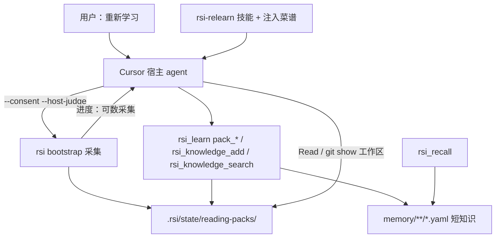
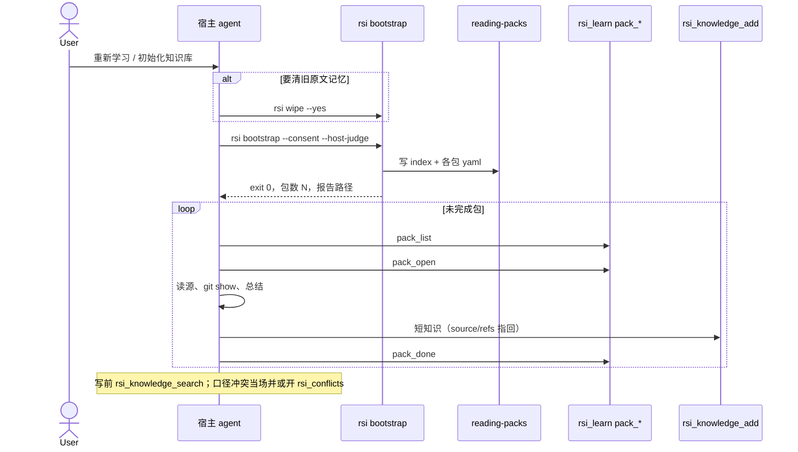

# 宿主蒸馏项目知识库 — 设计

> 日期：2026-09-14 | 状态：已定稿，待审阅  
> 范围：重新学习改为「rsi 采集阅读包 + 宿主蒸馏短知识」；进度与流程串联；**删除**原文直通、正文 Jaccard 出门、原文工作包队列及其测试，不留兼容分支  
> 取代并废止实现：`2026-09-12-bootstrap-apply-and-confirm-design.md` 车道 A；`2026-09-13-host-judge-conflict-design.md` 的 Jaccard 候选与 `host_judge_queue` 循环  
> 不取代：文件记忆 YAML SoT、`rsi_recall` 混合检索、教学/审计/晋升 DAG、`--host-judge` / `--local-judge` 旗标名、`rsi_conflicts` 工具名（仅服务已落盘短知识）  
> 非目标：rsi 进程内配置或调用任何 LLM API Key；自持 AgentLoop；改召回融合算法；自动提升无 `bootstrap_run_id` 的 archived  
> 删除纪律：方向错了的代码、测试、报告字段、注入句**本波删掉**。禁止「先断开调用、函数留着」「仅非 bootstrap 调用方」「另开 P1 兼容票」。旧规格文档可留作历史，实现不得再按它们长出第二条路径。

---

## 1. 设计目标与定位

### 1.1 核心定位

RSI 是宿主模型的**程序性记忆层**，不是仓库理解器。

用户说「重新学习」时，要先沉淀一套**项目级短知识**（约定、禁止项、架构要点、从 fix 抽出的教训），再在这套库上做召回、教学、自我改进。仓库里的 md、代码、git、skill、rule 是**证据**，不是记忆正文。

代码只做三件事：可数阶段的**进度与耗时**、把步骤**串起来**、给模型一份**阅读包目录**。深入分析与知识蒸馏必须留在当前对话的宿主 agent 里，与 Superpowers 读技能再动手同构。

### 1.2 已锁定的原则

1. **零 Key = 不另开计费通道。** 不配 OpenAI/Anthropic Key，不在 `rsi` 包里打 Chat Completions。宿主 Cursor agent（订阅里的模型）就是蒸馏器。禁止把「零 Key」读成「bootstrap 不能用模型」。
2. **代码不替代理解。** 禁止用分词、Jaccard、极性词窗口、骨架标识符点名来决定「两条知识是否互相否定」或「这段原文算不算项目知识」。这类实现按 §10 **删除**，不是降级或后期规划。
3. **召回只打蒸馏条目。** 原文路径写在 `source` / `refs` 上，不把几百行 md、代码骨架批、git 统计摘要写成 `active` 记忆。
4. **采集可离开对话，蒸馏不能。** `rsi bootstrap` 可以扫盘、列 fix、写阅读包后退出。写知识必须在同一轮（或紧接着的）宿主对话里完成。
5. **进度只预估可数工作。** 扫文件、列提交、分包有 ETA。模型读某个域、写几条知识，只报「第几包 / 还剩几包」，不估思考秒数。

### 1.3 要解决的问题

1. 现网 `rsi bootstrap --host-judge` 把文档切片、代码骨架批、git 摘要当知识入库，再用正文 Jaccard 两两配对，大仓库要十几分钟且读不懂 fix / 长文档。
2. `--host-judge` 只让模型裁决**已经成对的原文**，模型没有先总结再落库的位置。
3. 注入菜谱把「重新学习」译成一条长 CLI，agent 在子进程结束前插不进手。

---

## 2. 功能架构

### 2.1 架构总览



`--local-judge`：只跑采集、写阅读包、打报告，**不写记忆、不跑 Jaccard**。终端提示到 Cursor 对话里继续蒸馏。不删除阅读包。

### 2.2 模块职责

| 模块 | 职责 | 不做什么 |
|------|------|----------|
| 信号发现 / 采集 CLI | 列文档、代码路径、fix 提交、skill/rule；按域切阅读包；进度条 | 切片当知识、分词出门、原文 `active` |
| `reading-packs` | 包清单与每包源列表、状态、指纹 | 存全文、存大 diff |
| `rsi-relearn` 技能 + 注入菜谱 | 规定顺序：采集 → 逐包读源 → 搜索旧知识 → 写入 → `pack_done` | 让用户自己拼命令 |
| `rsi_learn` `pack_list` / `pack_open` / `pack_done` | 串联包状态 | 代写 lesson / 代写知识正文 |
| `rsi_knowledge_add` / `search` | 短知识落盘与去重检索 | 把阅读包源当 content |
| `rsi_conflicts` | 只处理**已落盘短知识**之间的冲突（模型写出后） | 对仓库原文做 Jaccard |
| `rsi_recall` | 检索蒸馏库 | 把阅读包当命中 |

不新增 MCP **工具名**。包编排挂在已有 `rsi_learn` 上，三个 action。

### 2.3 与教学 DAG 的关系

蒸馏产出的是 `convention` / `prohibition` / `documentation`（短）/ 必要时 `architecture` 要点。  
收工学习、教学、晋升仍按 `2026-09-13-readable-memory-rag-dag-design.md`：宿主写、RSI 落盘。输入必须是这些短条目，不是阅读包原文。

**修 bug 是对话中学习的一等写入，成功也要记。** 不是只在「修失败多次 / 用户纠正」时才 `teach_record`。本轮若修复了用户可见的缺陷（含一次就修好），宿主必须写下：

- **如何产生**（`wrong_action` / 触发条件：怎样写才会出这个 bug）
- **如何修复**（`correct_fix`：改了什么、为何这样就好）
- **下次规避**（`applies_to` + `error_signature`：哪些实现要躲开）

RSI 只收 lesson，不代写。写成 `teaching_case` + `gene-map/manual`。下一次同类任务 `rsi_recall` **必须**能带回这些案例（禁止项之后插 teaching/gene），不能再把「口语能打中 teaching」留到遥远 P1 才做——否则记了也规避不了。

禁止把整段 diff 或完整文件当 `content`；`content`/`correct_fix` 仍是短判断，路径放 `refs`。

---

## 3. 业务流程

### 3.1 对话路径（主路径）



漏旗标仍 exit 2：`必须指定 --host-judge 或 --local-judge`。对话路径只加 `--host-judge`，不加 `--local-judge`。

### 3.5 对话中学习（含修 bug）

不跑全库 bootstrap。任务开头 `rsi_recall`，然后按触发写入：

| 触发 | 宿主必做 | 落盘 |
|------|----------|------|
| **修了用户可见的 bug**（成功或失败都算） | `teach_catch`（现场）→ 写清如何产生 + 如何修复 → `teach_record` | teaching-case + gene-map/manual |
| 用户纠正做法 / 低置信 / 将改公共规则 | 同上 | 同上；`author=user` 时 weight=10 |
| 召回不准（反馈） | `rsi_feedback` | 过门槛才进 pending 禁止项/约定 |
| 用户要「记下来」的新约定 | `search` 后 `knowledge_add` | 短条 pending，再 review |

修 bug 的 lesson 缺 `wrong_action`（如何产生）或 `correct_fix`（如何修复）时，`teach_record` 必须 `invalid`，不得只交一句「已修好」。

收工仍走 audit → extract；extract **不能代替** 修 bug 当时的 `teach_record`。当场不记，收工再补容易丢「怎么写成的」。

### 3.2 采集阶段（有进度 / 有 ETA）

CLI 阶段只保留可数工作，建议序号：

| 阶段 | 计数对象 | 产出 |
|------|----------|------|
| 扫描文件树 | 已发现文件 | 信号计数（docs/code/git/…） |
| 文档索引 | 文档文件数 | 路径 + 一级标题，不切块入库 |
| 代码索引 | 源文件数 | 相对路径 + 短符号列表（可选，失败则只留路径） |
| Git fix | 纳入的提交数（默认最近 500，只收 fix/revert/明显修复标题） | hash、subject、触及文件 |
| 规则与技能 | skill/rule 文件数 | 路径 + 标题/name |
| 分包 | 包数 | `.rsi/state/reading-packs/` |

禁止再出现「冲突检测 0/11080」这类**原文配对**阶段。

采集目标耗时：gateway 体量（约 5k 代码文件、数百文档、500 commit）应在**约两分钟内**结束并退出。超时只允许出在 IO/扫描，不允许出在语义比对。

### 3.3 蒸馏阶段（无思考 ETA）

`pack_list` 返回 `total` / `done` / `pending`。终端或 agent 复述「阅读包 3/12」，不显示「约剩 14 分」。  
一包未 `pack_done` 不算完成。用户中断后，下一轮对话 `pack_list` 从剩余包继续，不强制重扫（指纹未变）。

### 3.4 `--local-judge`

合法，语义改为：**只采集、只写阅读包、不写 `memory/` 知识、不跑 conflict_gate。**  
stdout 固定提示：到 Cursor 对话里让 agent 按 `rsi-relearn` 继续。  
若存在旧的 `.rsi/host_judge_queue.json`，删除，避免 agent 误读上一版原文对队列。

---

## 4. 核心设计

### 4.1 阅读包

目录：`<project>/.rsi/state/reading-packs/`。

`index.yaml`：

```yaml
bootstrap_run_id: "<uuid>"
generated_at: "<iso>"
packs:
  - id: "<8+ hex or slug>"
    domain: "auth"
    title: "认证与会话"
    status: pending   # pending | done | skipped
    source_count: 18
    fingerprint: "<sha256 of member source fingerprints>"
```

`<pack_id>.yaml`：

```yaml
id: "..."
domain: "auth"
title: "认证与会话"
status: pending
sources:
  - kind: docs          # docs | code | git_fix | rule | skill | conversation
    path: "docs/auth.md"
    heading: "认证"
  - kind: git_fix
    hash: "abc1234"
    message: "fix token refresh NPE"
    files: ["src/auth/Token.java"]
  - kind: skill
    path: ".cursor/skills/foo/SKILL.md"
    name: "foo"
```

约束：

- **不写源文件正文、不写完整 diff。** 模型用 Read / `git show <hash>` 自己取。
- 单包 `sources` 最多 **40** 条；超出按子目录或路径前缀再切一包。
- 单次 run 最多 **80** 包；再多按顶层目录合并「其它」并在报告写 `omitted_sources`（路径列表封顶 200 行）。这是保护，不视为已学。
- `kind: git_fix`：subject 匹配 `fix` / `revert` / `hotfix` / `bug`（大小写不敏感）或 conventional `fix:`。纯 docs/chore 提交不进包，除非 `--include` 显式要 git 全量（本波不做全量开关，默认只要 fix 类）。
- 对话记录：只进「对话」域的包，仍然只给路径，不把整段 transcript 当知识。
- `auto-extract` / `item:` 来源不进阅读包。

分域（P0 启发式，不求完美）：

1. `.cursor/rules`、`.cursorrules`、`AGENTS.md` 用户块、`CLAUDE.md` → 域 `rules`
2. `**/SKILL.md`、项目 `config/skills` → 域 `skills`
3. 文档信号 → 按一级目录（`docs/`、`README*` 单独一包）
4. 代码 → 按仓库一级或二级目录（`src/foo`）
5. git_fix 按触及文件的主目录挂到对应代码/文档包；挂不上则进域 `git-fix`
6. 对话 → 域 `conversation`

同一源可以出现在一个包里，禁止同一 `path` 或同一 `hash` 出现在两个包（git_fix 以 hash 去重）。

### 4.2 什么是一条合法知识

蒸馏写入必须同时满足：

- `title` 是判断或职责，不是文件名本身（「认证失败重试三次」可以；「代码骨架摘要」不可以）。
- `content` 目标 **80～800 字**；硬顶 **1500 字**。超出由模型自己再拆条，RSI 超顶拒绝并返回 `invalid`。
- `extra.source_url` 或 `refs` 至少指向一个阅读包里的 `path` 或 git `hash`。
- `tags` 含 `bootstrap_run_id:<uuid>` 与 `signal:distilled`。
- 类型：`prohibition` | `convention` | `documentation` | `architecture`。本波蒸馏**禁止**再写「代码骨架摘要 / 项目配置与规范摘要 / Git 历史分析 / 跨信号关联图谱」这类采集物标题。

`rsi_knowledge_add`（含 CLI `knowledge add`）一律执行 1500 字硬顶，并拒绝上述四个历史采集标题（精确匹配）。`signal:distilled` 条目还必须带 `source`/`refs` 与 `bootstrap_run_id:` 标签，否则 `invalid`。无该标签的手工条目不强制 `refs`。

默认状态：蒸馏条目写 `pending_review`，由现有 `rsi_knowledge_review` / 注入菜谱整批放行本 `bootstrap_run_id`。P0 不把蒸馏条目静默 `active`，避免模型一句话写错就进召回主库。用户说「看着办 / 按推荐」时，agent 按现有 review 工具批准本 run。

### 4.3 采集 CLI 禁止再做的事

`--host-judge` 与 `--local-judge` 都不得再走旧写入/出门。对应符号按 §10 **整支删除**，不是改成 no-op。

`--force` 只忽略采集指纹、重写阅读包；**不**把旧 archived 救回 `active`（沿用现网）。

manifest：对源文件与 git hash 列表做指纹，未变且包已 `done` 的包，重跑时保留 `done`，不重开。`--force` 把未 `done` 与全部包都标回 `pending`（`--force` 重开全部包）。

### 4.4 冲突放在蒸馏之后

模型写每一条之前：`rsi_knowledge_search` 查近义旧条。能合并则更新/共存说明写在新条 `refs`；不能合并且命题互斥则 `rsi_conflicts` 记一条，两侧都是**短知识 id**，`user_rule_path` 可用 `item:<id>`。

RSI **不再**对阅读包源或仓库原文跑 Jaccard。  
`version` 文件家族（DEPRECATED 链接、同目录 `vX.Y`）采集期只写进阅读包的 `sources` 备注字段 `hint: version-family`，由模型读两份文档后决定写一条还是开冲突。不做正文词袋。

`--local-judge` 不产生冲突行。

上一版 `host_judge_queue.json` 的「原文对 + 当场 200 条 resolve」循环**废止**。注入菜谱改为吃阅读包，而不是吃原文队列。

### 4.5 技能与注入（流程串联）

随发行提供技能正文，bootstrap 成功后写入（或覆盖）：

`<project>/.cursor/skills/rsi-relearn/SKILL.md`

要点（实现时全文落盘，此处锁行为）：

1. 用户要重新学习 → 需要清原文记忆则 `rsi wipe --yes` → `rsi bootstrap --consent --host-judge`。
2. 不要自己发明 Jaccard，不要把源文件全文 `knowledge_add`。
3. 循环：`rsi_learn pack_list` → `pack_open` → 读源 → `rsi_knowledge_search` → `rsi_knowledge_add` → `pack_done`。
4. 一包至少 1 条知识，最多 20 条；写不出则 `pack_done` 带 `skipped` 与一句原因。
5. 全部 `done`/`skipped` 后，对本 run `rsi_knowledge_review` 列出蒸馏条，按用户意愿批准。
6. 不要让用户去终端手工跑 rsi（除 wipe/bootstrap 已由 agent 代跑）。

注入 `_DECISIONS_BODY` 中「重新学习」段替换为与上相同的顺序，去掉「读 host_judge_queue / 每批 200 resolve 原文对」。`rsi_conflicts` 仍用于蒸馏后的短知识冲突。

`rsi_recall` 技能目录暴露 `rsi-relearn`（name/description/path），与现网 skill catalog 一致。

### 4.6 `rsi_learn` 包 action

| action | 入参 | 出参 |
|--------|------|------|
| `pack_list` | 无 | `{total, done, pending, skipped, packs:[{id,title,domain,status,source_count}]}` |
| `pack_open` | `id` | 该包 yaml 字段（sources 不含正文） |
| `pack_done` | `id`，可选 `status=done\|skipped`，可选 `reason` | 更新后的包状态；非法 id → `not_found` |

未先 bootstrap、目录不存在：`pack_list` 返回空列表 + message 提示先跑 bootstrap，不报崩溃。  
`pack_done` 已是终态时幂等成功。

不把 `pack_*` 做成 CLI 子命令（P0）。agent 只用 MCP。

### 4.7 进度文案

采集阶段沿用现网 `Progress`（阶段名、条数、已用、约剩）。文案用中文阶段名，见 §3.2。  
蒸馏不走这段 CLI 进度。报告 JSON：

- 保留：`judge`（`host` | `local`）
- 新增：`pack_count`、`pack_omitted_sources`；采集阶段 `knowledge_written` 恒为 0
- **删除**字段及一切读写：`judge_candidates`、`judge_omitted`、`judge_unresolved`、`judge_queue_path`。禁止留空字符串 / 恒 0 做兼容。

---

## 5. 分期

**P0（本规格实现波必须交付）**

- 采集只写阅读包；按 §10 **删除**旧出门与原文入库，不是断开调用。
- `rsi_learn` 三个 `pack_*` action。
- 写入 `rsi-relearn` 技能 + 改注入菜谱。
- `knowledge_add` 体量硬顶 + 禁止四个历史采集标题。
- 进度阶段换成 §3.2；报告字段按 §4.7（旧 judge_* 字段删除）。
- 采集成功时若磁盘上还有 `host_judge_queue.json` 则删除文件；写队列的代码本身已不存在。
- 修 bug 成功也 `teach_record`；强制 `wrong_action` + `correct_fix`；召回带回 teaching/gene。

**P1（增强，不是旧路径复活）**

- 阅读包按语义再切域（仍由宿主决定怎么写知识）。
- 采集期符号列表更完整。
- 蒸馏条目经用户明确开关才自动 `active`。
- 新 MCP 工具名。

禁止把「本地启发式冲突 / Jaccard / 原文队列」写成 P1。那是已废方向，实现计划里不得开复活票。

---

## 6. 接口设计

本功能走 CLI + 现有 MCP，不是 HTTP REST。本地单用户，无 API Key。

### 6.1 CLI `rsi bootstrap`

| 项 | 说明 |
|----|------|
| 旗标 | `--host-judge` / `--local-judge` 仍互斥；非 dry-run 必居其一；exit 2 文案不变 |
| `--host-judge` 成功 | exit 0；已写阅读包；`knowledge_written=0`；stdout 含包数与技能名 `rsi-relearn` |
| `--local-judge` 成功 | 同采集；提示去对话蒸馏；删 `host_judge_queue.json` |
| `--dry-run` | 只打印将发现的信号与将生成的包数/域，不写盘 |
| 采集 IO 失败 | exit 1 |

### 6.2 MCP

现有：`rsi_knowledge_add`、`rsi_knowledge_search`、`rsi_knowledge_review`、`rsi_conflicts`、`rsi_recall`、`rsi_learn`。  
新增仅 `rsi_learn` 的 `pack_list` / `pack_open` / `pack_done`。  
`rsi_conflicts` 的 list/resolve/explain 行为不变，但 bootstrap 不再为它预灌原文对。

### 6.3 文件

| 路径 | 生命周期 |
|------|----------|
| `.rsi/state/reading-packs/index.yaml` | 每次采集重写（保留 done 指纹，见 §4.3） |
| `.rsi/state/reading-packs/<id>.yaml` | 同上；`pack_done` 改 status |
| `.cursor/skills/rsi-relearn/SKILL.md` | 采集成功覆盖写入 |
| `.rsi/host_judge_queue.json` | 本波起不再创建；采集成功时删除 |

---

## 7. 测试要点（实现时）

- 裸 bootstrap（非 dry-run）仍 exit 2；双旗标仍 exit 2。
- `--host-judge` 后 `memory/` 下不出现「代码骨架摘要」等四类采集标题；`reading-packs/index.yaml` 存在且 `packs` ≥ 1（有信号时）。
- 源码与测试中不存在 `gate_drafts`、`_peer_sim`、`_write_host_judge_queue`（禁止只 spy「没调用」）。
- 文档文件只出现在某个包的 `sources.path`，没有对应 chunk YAML。
- git 无 fix 类提交时不因此失败，只是没有 `git_fix` 源。
- `pack_list` 空目录不抛；`pack_open` 未知 id → not_found；`pack_done` 幂等。
- `knowledge_add` 超过 1500 字 → invalid；标题「代码骨架摘要」→ invalid。
- `--local-judge` 后无 `host_judge_queue.json`，有阅读包，`memory/` 无本 run 新知识。
- `--force` 将已 `done` 包改回 `pending`。
- 注入块含 `pack_list` / `rsi-relearn`，全文不得再出现 `host_judge_queue.json` 或「每批 200 resolve 原文对」。
- 注入收工纪律写明：修完用户可见 bug（成功也算）必须 `teach_record`，lesson 含如何产生与如何修复。
- `teach_record` 缺 `wrong_action` 或 `correct_fix` → invalid（实现时改现网「只强制 correct_fix」）。
- 召回在禁止项之后能带回刚写入的 teaching/gene（口语/同类实现描述可命中）。
- `tests/test_conflict_gate.py`、`tests/test_bootstrap_judge_flags.py` 中依赖 Jaccard / 原文队列的用例**删除或改写成阅读包**，禁止为已删函数保测试。

---

## 8. 与既有设计的关系

| 文档 | 本规格之后 |
|------|------------|
| `2026-09-12-bootstrap-apply-and-confirm-design.md` | 车道 A「无冲突原文 `active`」作废。车道 B（对话/规则抽取待审）并入阅读包域 `conversation` / `rules`，由宿主蒸馏后走 `pending_review`。车道 C 改为短知识冲突，不再是原文组。切片参数不再用于「一条记忆」，只可能用于模型自己阅读时的提示（P0 不实现自动再切）。 |
| `2026-09-13-host-judge-conflict-design.md` | 旗标、exit 2、零 Key（修订口径：宿主 agent = 模型）保留。Jaccard 出门、`host_judge_queue` 原文循环、工作包硬顶 10000 对 **废止**。 |
| `2026-09-13-readable-memory-rag-dag-design.md` | YAML SoT、召回、教学/审计/晋升不变。补充：召回主集是 `signal:distilled` 与其后晋升的正式条目；阅读包不是记忆。 |

旧仓库里已有的骨架摘要 / 文档切片：用户「重新学习」且 wipe 则清掉。不 wipe 的增量采集不自动删除旧原文知识；报告加一行警告：库存仍有非 `signal:distilled` 的采集物，召回可能被淹没。P0 不强制迁移脚本。

---

## 9. 错误与中断

| 情况 | 行为 |
|------|------|
| 采集中途失败 | 不留下半份 index（写 tmp 再 replace）；已有旧 packs 保持上一成功 run |
| 蒸馏中途用户停 | 已 `pack_done` 的包保留；已 add 的 pending 知识保留；下次 `pack_list` 继续 |
| 源文件在蒸馏期间被删 | 模型跳过该源；包仍可 `skipped` 或对其余源 `done` |
| 技能目录不可写 | 采集仍成功；报告警告；注入菜谱仍含同等步骤，agent 不依赖技能文件也能串下去 |

---

## 10. 删除清单（实现波必须清掉）

方向错了，留着就是脏代码。本波 PR 合入后，下列符号/文件/字段必须从树里消失（含测试与文案引用），不得 `if False`、不得改成空函数、不得「给日常提取留一条」。

| 删除 | 说明 |
|------|------|
| `src/rsi_boot/scanner/conflict_gate.py` 整文件 | `DraftItem` / `gate_drafts` / `_peer_sim` / `_body_jaccard` / `_detect_incoherent_conflicts` / `_detect_doc_code_conflicts` / `_local_peer_conflict` / `_MAX_CANDIDATES` 正文 Jaccard 门。`ConflictDraft` 若 `persist_knowledge_conflicts` 仍需要，**搬到** `injector/conflict.py`（只表示短知识对），不要为搬迁保留 Jaccard。 |
| bootstrap 里一切 `DraftItem` 组装与 `gate_drafts(...)` | 文档 chunk 入库、代码 3000 字骨架批、配置/Git/关联摘要当知识、`_load_existing_drafts`、`_source_to_item_id` 为队列服务的全库扫描 |
| `_write_host_judge_queue` / `_delete_host_judge_queue` 以外的队列写入、分页拼原文对 | 采集结束可保留「若文件存在则 unlink」三五行，函数名不要再叫 host_judge_queue 业务 |
| `BootstrapReport` 的 `judge_candidates` / `judge_omitted` / `judge_unresolved` / `judge_queue_path` | 报告打印与测试断言一并删 |
| 注入 `_DECISIONS_BODY` 中读队列、200 条 resolve 原文对的句子 | 换成阅读包循环 |
| `tests/test_conflict_gate.py` | 整文件删，或只留与阅读包无关且不导入已删模块的内容（预期：整文件删） |
| `tests/test_bootstrap_judge_flags.py` 里队列/Jaccard 对齐用例 | 改成旗标 exit 2 + 阅读包存在；禁止再 import `_write_host_judge_queue` |
| 其它测试里「骨架摘要入库」「同桶配对进度」 | 改或删，禁止 skip 挂起 |

**明确保留（不是旧门的兼容层）：**

- `injector/conflict.py`：手写规则 vs **已落盘短知识** 的 contradiction/stale/overlap（文件证据）。禁止把已删的 peer Jaccard 抄回这里。
- `scanner/version_conflict.py`：只给阅读包写 `hint: version-family`（路径/DEPRECATED 链接）。删除任何「标题相同再算正文 Jaccard」的调用点。
- `rsi_conflicts` MCP：模型对短知识 id 开冲突、list/resolve/explain。

日常提取（对话/反馈里抽句子）若今天调用 `conflict_gate`：本波改为只 `knowledge_search` + 可选手写 `rsi_conflicts`，**不得**再走 Jaccard。没有第三条「旧门给提取用」的路径。

---

## 11. 验收标准

在 `calcite-avatica-gateway` 量级仓库上：

1. `--host-judge` 采集在约两分钟内结束（同机器、杀毒例外），进度阶段无「同桶配对」。
2. 采集结束后 `memory/` 不新增原文切片；存在阅读包。
3. 宿主按技能逐包写出短知识后，`rsi_recall` 能用口语问到约定/禁止项，而不是某 md 第 N 节原文。
4. 全程不要求用户配置 API Key。
