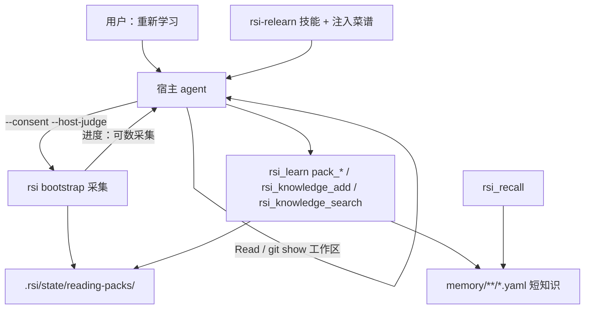
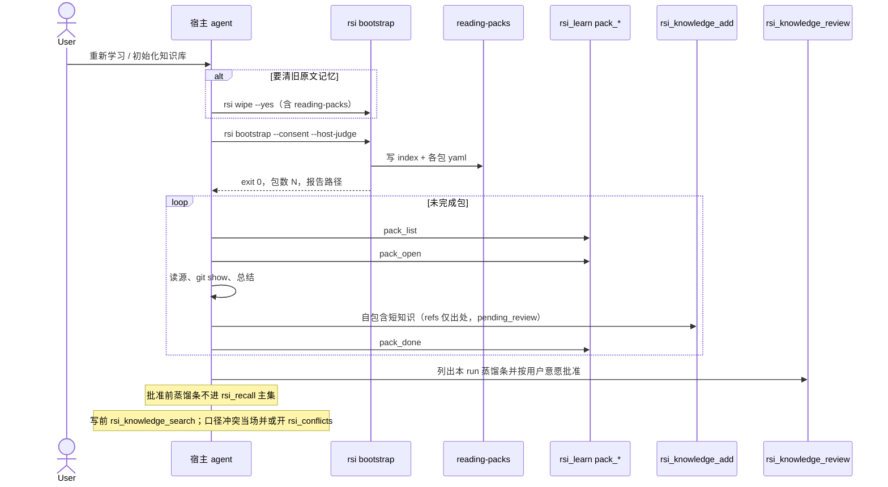

# 宿主蒸馏项目知识库 — 设计

> 日期：2026-09-14 | 状态：已定稿（技能归属修订）  
> 范围：重新学习改为「rsi 采集阅读包 + 宿主蒸馏短知识」；进度与流程串联；**删除**原文直通、正文 Jaccard 出门、原文工作包队列及其测试，不留兼容分支  
> 取代并废止实现：`2026-09-12-bootstrap-apply-and-confirm-design.md` 车道 A；`2026-09-13-host-judge-conflict-design.md` 的 Jaccard 候选与 `host_judge_queue` 循环  
> 不取代：文件记忆 YAML SoT、`rsi_recall` 混合检索骨架、教学/审计/晋升目录、`--host-judge` / `--local-judge` 旗标名、`rsi_conflicts` 工具名（仅服务已落盘短知识）  
> 本规格**改写**（以本文为准，覆盖 DAG 对应段落）：`teach_record` 权重与合并、`rsi_recall` 信封（`role` / `suggestions[]` / `retrieved` 必须含案例 id）、召回/search 可见集（蒸馏须先 review 才进召回；search 含本 run pending 蒸馏条；旧采集物两边都排除）、wipe 清阅读包、低置信 teaching 仍立刻可召回、口语能打中 teaching 提前到 P0  
> 非目标：rsi 进程内配置或调用任何 LLM API Key；自持 AgentLoop；改召回融合算法（过滤主集 ≠ 改融合）；自动提升无 `bootstrap_run_id` 的 archived  
> 删除纪律：方向错了的代码、测试、报告字段、注入句**本波删掉**。禁止「先断开调用、函数留着」「仅非 bootstrap 调用方」「另开 P1 兼容票」。旧规格文档可留作历史，实现不得再按它们长出第二条路径。

---

## 1. 设计目标与定位

### 1.1 核心定位

RSI 是宿主模型的**程序性记忆层**，不是仓库理解器。

用户说「重新学习」时，要先沉淀一套**项目级短知识**（约定、禁止项、架构要点、从 fix 抽出的教训），再在这套库上做召回、教学、自我改进。仓库里的 md、代码、git、skill、rule 是**证据**，不是记忆正文。

代码只做三件事：可数阶段的**进度与耗时**、把步骤**串起来**、给模型一份**阅读包目录**。深入分析与知识蒸馏必须留在当前对话的宿主 agent 里，与 Superpowers 读技能再动手同构。

### 1.2 已锁定的原则

1. **零 Key = 不另开计费通道。** 不配 OpenAI/Anthropic Key，不在 `rsi` 包里打 Chat Completions。当前宿主 agent（Cursor / Codex / Claude 等订阅里的模型）就是蒸馏器。禁止把「零 Key」读成「bootstrap 不能用模型」。禁止把「宿主」读成「必须是 Cursor」。
2. **代码不替代理解。** 禁止用分词、Jaccard、极性词窗口、骨架标识符点名来决定「两条知识是否互相否定」或「这段原文算不算项目知识」。这类实现按 §10 **删除**，不是降级或后期规划。
3. **知识点自包含。** 落盘的是一条已经说完的判断，读 `title`+`content` 即可用，不依赖再打开仓库文件或 git。`source` / `refs` 只是**出处快照**（当时从哪蒸馏的），不是正文的一部分，也**不随外部文件变更而改写**。禁止「refs 变了就同步更新知识」——那会把改文档的代价绑到整库记忆上。外部变了：旧知识保持有效；增量学习可以**另写**新条或由宿主**显式**修订/归档旧条。
4. **采集可离开对话，蒸馏不能。** `rsi bootstrap` 可以扫盘、列 fix、写阅读包后退出。写知识必须在同一轮（或紧接着的）宿主对话里完成。
5. **进度只预估可数工作。** 扫文件、列提交、分包有 ETA。模型读某个域、写几条知识，只报「第几包 / 还剩几包」，不估思考秒数。
6. **蒸馏条须 review 批准后才进召回。** 默认 `pending_review`，不静默 `active`。批准前 `rsi_recall` 主集看不到它们。`rsi_knowledge_search` 为去重**必须**能看到本 run 这些待审条（见 §4.9）。修 bug 的 teaching/gene 不走这条：首次落盘即可召回，**低置信也一样**（见 §3.6），不得因 `pending` 目录被召回丢掉。
7. **增量不 wipe 时，召回与 search 都排除旧采集物。** 盘上可暂留骨架摘要 / 文档切片等车道 A 产物，但不得再进入 `rsi_recall` 主集，也不得进入 `rsi_knowledge_search` 去重结果（识别见 §4.8）。P0 不强制迁移删除脚本。
8. **`rsi wipe --yes` 必须删阅读包。** 与现网清 `.rsi/state` 一致。禁止只清 `memory/`、留下已 `done` 的包，以致下一轮采集跳过蒸馏。

### 1.3 要解决的问题

1. 现网 `rsi bootstrap --host-judge` 把文档切片、代码骨架批、git 摘要当知识入库，再用正文 Jaccard 两两配对，大仓库要十几分钟且读不懂 fix / 长文档。
2. `--host-judge` 只让模型裁决**已经成对的原文**，模型没有先总结再落库的位置。
3. 注入菜谱把「重新学习」译成一条长 CLI，agent 在子进程结束前插不进手。

---

## 2. 功能架构

### 2.1 架构总览



`--local-judge`：只跑采集、写阅读包、打报告，**不写蒸馏知识、不开冲突**。仍 upsert `rsi-relearn`。终端提示：在当前宿主对话里按 `rsi-relearn` 继续蒸馏。不删除阅读包。不点名某一家 IDE。

### 2.2 模块职责

| 模块 | 职责 | 不做什么 |
|------|------|----------|
| 信号发现 / 采集 CLI | 列文档、代码路径、fix 提交、skill/rule；按域切阅读包；进度条 | 切片当知识、分词出门、原文 `active` |
| `reading-packs` | 包清单与每包源列表、状态、指纹 | 存全文、存大 diff |
| `rsi-relearn` 技能 + 注入菜谱 | 规定顺序：采集 → 逐包读源 → 搜索旧知识 → 写入 → `pack_done` → review | 让用户自己拼命令 |
| `rsi_learn` `pack_list` / `pack_open` / `pack_done` | 串联包状态 | 代写 lesson / 代写知识正文 |
| `rsi_knowledge_add` / `search` | 短知识落盘与去重检索（search 见 §4.9） | 把阅读包源当 content；把旧采集物当近义命中 |
| `rsi_conflicts` | 只处理**已落盘短知识**之间的冲突（模型写出后） | 对仓库原文做 Jaccard；bootstrap 预灌原文对 |
| `rsi_recall` | 检索蒸馏库（批准后）+ teaching/gene（含低置信） | 把阅读包当命中；返回未批准蒸馏条；返回旧采集物 |

不新增 MCP **工具名**。包编排挂在已有 `rsi_learn` 上，三个 action。

### 2.3 与教学 DAG 的关系

蒸馏产出的是 `convention` / `prohibition` / `documentation`（短）/ 必要时 `architecture` 要点。  
收工学习、教学、晋升仍按 `2026-09-13-readable-memory-rag-dag-design.md` 的 YAML SoT / 审计 / 晋升目录。输入必须是这些短条目，不是阅读包原文。

**权重、召回信封、口语打中 teaching 以本文 §3.5–§3.6、§4.8–§4.9 为准**，覆盖 DAG 里「首次 teaching weight=8/10」「低置信进 pending」「口语打中 teaching 留 P1」等旧句。

**修 bug 是对话中学习的一等写入，成功也要记。** 不是只在「修失败多次 / 用户纠正」时才 `teach_record`。本轮若修复了用户可见的缺陷（含一次就修好），宿主必须写下：

- **如何产生**（`wrong_action` / 触发条件：怎样写才会出这个 bug）
- **如何修复**（`correct_fix`：改了什么、为何这样就好）
- **下次规避**（`applies_to` + `error_signature`：哪些实现要躲开）

RSI 只收 lesson，不代写。写成 `teaching_case` + `gene-map/manual`。下一次同类任务 `rsi_recall` **必须**能带回这些案例（禁止项之后插 teaching/gene）。

首次落盘是**低权建议**（见 §3.6），不是正式禁止项。宿主应按建议参考，不得当成 alwaysApply。同一缺陷被召回命中后又修一次，再抬权重；抬够了才进入晋升候选。

禁止把整段 diff 或完整文件当 `content`；`content`/`correct_fix` 必须自包含。路径只进 `refs` 做出处，召回不打开它们。

---

## 3. 业务流程

### 3.1 对话路径（重新学习 / 初始化）



漏旗标仍 exit 2：`必须指定 --host-judge 或 --local-judge`。对话路径只加 `--host-judge`，不加 `--local-judge`。

`rsi wipe --yes` 必须删除 `.rsi/state/reading-packs/`（可随整棵 `state/` 一起删）。只清 `memory/`、留下已 `done` 包，视为错误实现。不 wipe 的增量按 §3.7 保留指纹未变的 `done`。

### 3.2 采集阶段（有进度 / 有 ETA）

CLI 阶段只保留可数工作：

| 阶段 | 计数对象 | 产出 |
|------|----------|------|
| 扫描文件树 | 已发现文件 | 信号计数（docs/code/git/…） |
| 文档索引 | 文档文件数 | 路径 + 一级标题，不切块入库 |
| 代码索引 | 源文件数 | 相对路径 + 短符号列表（可选，失败则只留路径） |
| Git fix | 纳入的提交数（默认最近 500，只收修复类标题） | hash、subject、触及文件 |
| 规则与技能 | skill/rule 文件数 | 路径 + 标题/name |
| 分包 | 包数 | `.rsi/state/reading-packs/` |

禁止再出现「冲突检测 0/11080」这类**原文配对**阶段。

采集目标耗时：gateway 体量（约 5k 代码文件、数百文档、500 commit）**宜**在约两分钟内结束并退出。这是机器相关**目标**，不是硬失败门槛；杀毒/冷盘可超时。超时只允许出在 IO/扫描，不允许出在语义比对。

### 3.3 蒸馏阶段（无思考 ETA）

`pack_list` 返回 `total` / `done` / `pending`。终端或 agent 复述「阅读包 3/12」，不显示「约剩 14 分」。  
一包未 `pack_done` 不算完成。用户中断后，下一轮对话 `pack_list` 从剩余包继续，不强制重扫（指纹未变）。

本阶段写入的蒸馏条一律 `pending_review`。全部包 `done`/`skipped` 后走 `rsi_knowledge_review`。用户说「看着办 / 按推荐」时，agent 按现有 review 工具批准本 `bootstrap_run_id`。批准前召回主集不含这些条。

### 3.4 `--local-judge`

合法，语义改为：**只采集、只写阅读包、不写蒸馏知识、不开冲突。**  
仍按 §4.5 upsert `rsi-relearn`（产品技能，不是项目蒸馏条）。  
stdout 固定提示：在当前宿主对话里按 `rsi-relearn` 继续（经 `rsi_recall` 取技能，不要求某家 IDE）。  
若存在旧的 `.rsi/host_judge_queue.json`，删除，避免 agent 误读上一版原文对队列。

### 3.5 对话中学习（含修 bug）

不跑全库 bootstrap。任务开头 `rsi_recall`，然后按触发写入：

| 触发 | 宿主必做 | 落盘 |
|------|----------|------|
| **修了用户可见的 bug**（成功或失败都算） | `teach_catch` → 如何产生 + 如何修复 → `teach_record` | teaching + gene 写**正式目录**；**立刻可召回**，首次 weight=2（建议） |
| 用户纠正做法 / 将改公共规则 | 同上 | `author=user` 时 weight=10（你已定性，不是建议） |
| 低置信但未形成 bug | 可记 | 同首次修 bug：weight=2，仍写正式目录，立刻可召回；低置信只打标记，**不**改 `pending_review` |
| 召回不准（反馈） | `rsi_feedback` | 过门槛才进 pending 禁止项/约定 |
| 用户要「记下来」的新约定 | `search` 后 `knowledge_add` | 短条 `pending_review`，**review 批准后**才进召回主集 |

修 bug 的 lesson 缺 `wrong_action`（如何产生）或 `correct_fix`（如何修复）或空 `error_signature` 时，`teach_record` 必须 `invalid`，不得只交一句「已修好」。

收工仍走 audit → extract；extract **不能代替** 修 bug 当时的 `teach_record`。当场不记，收工再补容易丢「怎么写成的」。

### 3.6 修 bug 权重（建议 → 加重）

现网 `teach_record` 一律 weight=8/10，首次修 bug 会过重。改为：

| 事件 | 权重与计数 | 召回 |
|------|------------|------|
| 该 `error_signature` **第一次** `teach_record`（agent 修 bug，非用户纠正） | `weight=2`，`record_count=1`，`recall_hits=0` | **马上可见**（正式目录，含低置信），排在禁止项之后，按 weight 升序靠后；文案/技能当「建议规避」，不写进 alwaysApply mdc |
| 距**上一次**该 id 的 `teach_record` 之后，该 id 至少进过一次 `rsi_recall` 的 `retrieved`，再因同类 bug `teach_record` | 同一 id **加 2**（封顶 10），`record_count+1`，可改 `correct_fix`；**不新建**一条 | 仍马上可见，排序随 weight 前移 |
| 再次 record，但距上次 record **之后**从未进入 `retrieved` | `record_count+1`，只追加 attempts，**不加** weight | 避免「命中过一次就每次刷分」或「没人用到却刷分」 |
| `author=user`（你纠正） | 直接至少 10；见下方合并规则 | 你已拍板，不是建议 |

**计数不得混用一个 `hit_count`。** 盘上字段：

| 字段 | 含义 |
|------|------|
| `record_count` | 该 id 被 `teach_record` 写入或更新的次数；首次=1 |
| `recall_hits` | 该 id 出现在历史 `retrieved` 中的次数（每次 recall 事件含该 id 计 1） |

旧 YAML 只有 `hit_count` 时：读成 `record_count`，`recall_hits=0`。实现可继续写 `hit_count` 作为 `record_count` 的别名。

**加分窗口：** 只认「上一次该 id 的 `teach_record` 时刻之后」的 `retrieved`。历史上曾经命中过、但两次 record 之间没有新命中，**不加**。`recall_hits` 可以是累计次数（`teach_record` 时扫事件即可，不必每次召回回写 YAML）；是否 +2 **不**等于 `recall_hits >= 1`。

晋升候选：`record_count >= 3` **或** `weight >= 8`。进入 `rsi_learn promote` 的 pending 约定/禁止项，**不**自动进正式 mdc。晋升仍走 review。

**同 `error_signature` 合并（禁止复制一条同内容 YAML）：**

- `error_signature` 去空白后为空 → `teach_record` **invalid**（否则空签名会并成全世界一条）。
- 已有同签名（现网还比 `failure_type`）则更新那条，不新建。
- `author=user` **一旦**写过该 id：`weight = max(当前, 10)`，之后**只升不降**；后续 agent `teach_record` 不得把 weight 打回 2。
- 先 agent（2）后 user：升到 10，可更新 `correct_fix`。
- 先 user（10）后 agent：保持 ≥10，只追加 attempts / 可选更新正文。

实现要点：

- `teach_record` 仍强制 `wrong_action` + `correct_fix` + 非空 `error_signature`。
- 修 bug / 低置信 teaching 与对应 gene **写正式目录**（`status` 按目录为 active）。禁止再把 `low_confidence` 落到 `teaching-cases/pending/` 以致召回看不见。低置信可用 payload 标记，不改变召回资格。
- 召回必须带上 weight=2 的新案例；禁止「权太低就不返回」。
- 注入纪律：修完用户可见 bug 就要记。
- **`retrieved` 必须包含**本轮返回的 teaching / gene / `suggestions[]` / prohibitions / items 的全部 id（按 id 去重）。否则加分条件永远不成立。现网若 `retrieved` 只记 prohibition/items，本波必须改。

**召回信封（建议与强约束分开）：**

`rsi_recall` 的 `teaching_cases[]` / `gene_cases[]` **每条**增加：

| 字段 | 值 |
|------|-----|
| `weight` | 整数，与盘上一致 |
| `role` | `suggestion`（weight &lt; 8）或 `constraint`（weight ≥ 8，或该 id 曾 `author=user`） |

另增顶层 **`suggestions[]`**：上述两条里 `role=suggestion` 的拷贝（同一套 id/title/content/source_path/weight/role），方便宿主先扫建议、不必自己按 weight 过滤。

去重：teaching 与 gene 现网常共用一个 id，召回已跳过重复 gene。`suggestions[]` **按 id 去重，teaching 优先**。同一 id 不得出现两次。`prohibitions[]` / 正式 `items[]` **不**进 `suggestions`，也不带 `role=suggestion`。

weight 升到 ≥ 8 后：该条离开 `suggestions[]`，只留在 `teaching_cases`/`gene_cases` 且 `role=constraint`。晋升进正式 prohibition 之前，**仍不是** alwaysApply mdc。

宿主纪律：`role=suggestion` 只参考，可不用；`role=constraint` 按应遵守处理，但仍须走 promote+review 才能进规则文件。

### 3.7 定期增量（自我改进）

不跑无人值守的 LLM cron。`--watch` 只盯 YAML 文件记忆，不蒸馏。

用户（或宿主按菜谱）再跑 `rsi bootstrap --consent --host-judge`（通常**不** wipe）：

1. 指纹未变且已 `done` 的包保留 `done`，不重开。
2. 指纹变了的包标回 `pending`；**已写入的记忆 YAML 不自动改写**（§1.2 原则 3）。宿主重开包后可另写新条或显式修订/归档旧条。
3. 采集本身仍不写知识。蒸馏、review 仍在对话里做。
4. 召回主集按 §4.8、search 按 §4.9：**排除旧采集物**；召回只看到已批准的 `signal:distilled`、正式目录教学/gene、以及非采集物的正式条目。
5. 并行：`rsi_learn promote` 候选、`rsi_feedback` 过门槛的 pending，仍走现有 review，不另开自动 active。

---

## 4. 核心设计

### 4.1 阅读包

目录：`<project>/.rsi/state/reading-packs/`。

`index.yaml`：

```yaml
bootstrap_run_id: "<uuid>"
generated_at: "<iso>"
packs:
  - id: "<8+ hex or slug>"
    domain: "auth"
    title: "认证与会话"
    status: pending   # pending | done | skipped
    source_count: 18
    fingerprint: "<sha256 of member source fingerprints>"
```

`<pack_id>.yaml`：

```yaml
id: "..."
domain: "auth"
title: "认证与会话"
status: pending
sources:
  - kind: docs          # docs | code | git_fix | rule | skill | conversation
    path: "docs/auth.md"
    heading: "认证"
  - kind: git_fix
    hash: "abc1234"
    message: "fix token refresh NPE"
    files: ["src/auth/Token.java"]
  - kind: skill
    path: ".cursor/skills/foo/SKILL.md"
    name: "foo"
```

约束：

- **不写源文件正文、不写完整 diff。** 模型用 Read / `git show <hash>` 自己取。
- 单包 `sources` 最多 **40** 条；超出按子目录或路径前缀再切一包。
- 单次 run 最多 **80** 包；再多按顶层目录合并「其它」并在报告写 `omitted_sources`（路径列表封顶 200 行）。这是保护，不视为已学。
- `kind: git_fix`：subject 匹配（大小写不敏感）`fix` / `revert` / `hotfix` / `bug`、conventional `fix:`，以及中文 **`修复` / `缺陷` / `回滚`**。纯 docs/chore 提交不进包，除非日后显式全量开关（P0 不做该开关）。
- 对话记录：只进「对话」域的包，仍然只给路径，不把整段 transcript 当知识。
- `auto-extract` / `item:` 来源不进阅读包。

分域（P0 启发式，不求完美）：

1. `.cursor/rules`、`.cursorrules`、`AGENTS.md` 用户块、`CLAUDE.md` → 域 `rules`
2. `**/SKILL.md`、项目 `config/skills` → 域 `skills`
3. 文档信号 → 按一级目录（`docs/`、`README*` 单独一包）
4. 代码 → 按仓库一级或二级目录（`src/foo`）
5. git_fix 按触及文件的主目录挂到对应代码/文档包；挂不上则进域 `git-fix`
6. 对话 → 域 `conversation`

同一源可以出现在一个包里，禁止同一 `path` 或同一 `hash` 出现在两个包（git_fix 以 hash 去重）。

### 4.2 什么是一条合法知识

蒸馏写入必须同时满足：

- `title` 是判断或职责，不是文件名本身（「认证失败重试三次」可以；「代码骨架摘要」不可以）。
- `content` **硬顶 1500 字**；RSI 超顶拒绝并返回 `invalid`。80～800 字是给宿主的**篇幅指引**，不是门槛——「禁止 SELECT *」这种短禁止项合法，不得为凑 80 字注水。超出硬顶由模型自己再拆条。
- `content` 必须把结论写进正文：读完就能执行，不必再去打开 `refs`。禁止宿主把正文写成「详见 docs/foo.md」。这是**宿主纪律**，`knowledge_add` **不做**「详见 / 见 xxx.md」字符串警察（会误伤「见 FooService 的重试」这类正文）。
- `extra.source_url` 或 `refs` 可选但蒸馏条建议带：**仅出处**（path / git hash / 当时指纹）。召回、注入、冲突比较都**只读本条 YAML**，不解析、不拉取 ref 正文。
- RSI **不**监听仓库文件去改已落盘知识。阅读包指纹变了只让**新包**变 `pending`，已写入的记忆不动。
- `tags` 含 `bootstrap_run_id:<uuid>` 与 `signal:distilled`。
- 类型：`prohibition` | `convention` | `documentation` | `architecture`。本波蒸馏**禁止**再写「代码骨架摘要 / 项目配置与规范摘要 / Git 历史分析 / 跨信号关联图谱」这类采集物标题。

`rsi_knowledge_add`（含 CLI `knowledge add`）一律执行 1500 字硬顶，并拒绝上述四个历史采集标题（精确匹配）。`signal:distilled` 必须带 `bootstrap_run_id:`；`refs` 不再作为合法性条件（有则当出处，无也可以）。禁止实现「打开 ref 文件把内容拼进召回」。

默认状态：蒸馏条目写 `pending_review`，由现有 `rsi_knowledge_review` / 注入菜谱整批放行本 `bootstrap_run_id`。P0 **不**把蒸馏条目静默 `active`。用户说「看着办 / 按推荐」时，agent 按现有 review 工具批准本 run。

**召回时序：** `pending_review` 蒸馏条不进 `rsi_recall` 主集；`rsi_knowledge_review` 批准为 `active` 之后才进。教学/gene 仍按 §3.6 立刻可见，与蒸馏待审并存、两条时间线不得混写成一句。

### 4.3 采集 CLI 禁止再做的事

`--host-judge` 与 `--local-judge` 都不得再走旧写入/出门。对应符号按 §10 **整支删除**，不是改成 no-op。

`--force` **只**做一件事：忽略采集指纹，重写阅读包，并把**全部**包标为 `pending`（含上一 run 已 `done`）。不把旧 archived 知识救回 `active`（沿用现网）。

manifest：对源文件与 git hash 列表做指纹，未变且包已 `done` 的包，重跑（无 `--force`）时保留 `done`，不重开。

### 4.4 冲突放在蒸馏之后

模型写每一条之前：`rsi_knowledge_search` 查近义旧条（可见集见 §4.9，不是现网「只搜 active 正式条」）。能合并则更新/共存说明写在新条 `refs`；不能合并且命题互斥则 `rsi_conflicts` 记一条，两侧都是**短知识 id**，`user_rule_path` 可用 `item:<id>`。

RSI **不再**对阅读包源或仓库原文跑 Jaccard。  
`version` 文件家族（DEPRECATED 链接、同目录 `vX.Y`）采集期只写进阅读包的 `sources` 备注字段 `hint: version-family`，由模型读两份文档后决定写一条还是开冲突。不做正文词袋。

`--local-judge` 不产生冲突行。

上一版 `host_judge_queue.json` 的「原文对 + 当场 200 条 resolve」循环**废止**。注入菜谱改为吃阅读包，而不是吃原文队列。

bootstrap **不再**调用 `persist_knowledge_conflicts` / 组装 `ConflictDraft` 灌库。该入口若只服务 Jaccard 原文对，本波**删除**，不「搬走备用」。短知识冲突只由宿主经 `rsi_conflicts` 按 id 开出。

**手写规则 vs 记忆**（`injector/conflict.py` 现有 contradiction/stale/overlap）**保留**：只把手写规则文件与**已落盘短知识**的标题/禁止项正文相比。禁止把已删的仓库原文 Jaccard 抄回这里。这不是「代码替代理解」的复活，是规则文件与记忆条的对账。

### 4.5 技能与注入（流程串联）

`rsi-relearn` 是 RSI 自己的程序性记忆，不是某家 IDE 的项目技能文件。

随发行提供技能正文（包内模板）。bootstrap 成功后 **upsert** 一条正式 `type=skill` MemoryDoc：

- 目录：`<project>/.rsi/memory/skills/`（`official_dir(..., "skill")`）
- `payload.name`（及 catalog `name`）=`rsi-relearn`
- `status=active`（立刻进 `rsi_recall.skills`，不走 `pending_review`）
- `content` = 完整步骤（读 catalog 的 path / `rsi_memory open` 即可执行）
- 已有同 `payload.name` 则覆盖同一条（保留 id），不新建副本
- `wipe --yes` 会清掉它；下一轮 bootstrap 必须重写

**禁止**写入 `.cursor/skills/`、`.claude/skills/` 或其它宿主技能目录。那些是可选 **P1 导出适配器**，不是 SoT。采集阅读包仍可把仓库里已有的 `**/SKILL.md` 当证据（§4.1 分域 `skills`），那是读别人的技能，不是写 `rsi-relearn`。

`rsi_recall` 技能目录**只**读 `store.list_official("skill")`（name / description / path）。禁止遍历 `.cursor/skills`、`.claude/skills` 或 `config/skills` 来拼 catalog。

要点（`content` 必须含，此处锁行为）：

1. 用户要重新学习 → 需要清原文记忆则 `rsi wipe --yes`（会清阅读包）→ `rsi bootstrap --consent --host-judge`。
2. 不要自己发明 Jaccard，不要把源文件全文 `knowledge_add`。
3. 循环：`rsi_learn pack_list` → `pack_open` → 读源 → `rsi_knowledge_search` → `rsi_knowledge_add` → `pack_done`。
4. 一包至少 1 条知识，最多 20 条；写不出则 `pack_done` 带 `skipped` 与一句原因。
5. 全部 `done`/`skipped` 后，对本 run `rsi_knowledge_review` 列出蒸馏条，按用户意愿批准。**未批准不得声称召回已能用这些约定。**
6. 不要让用户去终端手工跑 rsi（除 wipe/bootstrap 已由 agent 代跑）。

注入 `_DECISIONS_BODY` 中「重新学习」段替换为与上相同的顺序，去掉「读 host_judge_queue / 每批 200 resolve 原文对」。`rsi_conflicts` 仍用于蒸馏后的短知识冲突。注入与 stdout **不**点名某一家 IDE。

### 4.6 `rsi_learn` 包 action

| action | 入参 | 出参 |
|--------|------|------|
| `pack_list` | 无 | `{total, done, pending, skipped, packs:[{id,title,domain,status,source_count}]}` |
| `pack_open` | `id` | 该包 yaml 字段（sources 不含正文） |
| `pack_done` | `id`，可选 `status=done\|skipped`，可选 `reason` | 更新后的包状态；非法 id → `not_found` |

未先 bootstrap、目录不存在：`pack_list` 返回空列表 + message 提示先跑 bootstrap，不报崩溃。  
`pack_done` 已是终态时幂等成功。

不把 `pack_*` 做成 CLI 子命令（P0）。agent 只用 MCP。

### 4.7 进度文案

采集阶段沿用现网 `Progress`（阶段名、条数、已用、约剩）。文案用中文阶段名，见 §3.2。  
蒸馏不走这段 CLI 进度。报告 JSON：

- 保留：`judge`（`host` | `local`）
- 新增：`pack_count`、`pack_omitted_sources`；采集阶段 `knowledge_written` 恒为 0
- 增量采集：若盘上仍有 §4.8 定义的旧采集物，报告加一行警告（路径或条数），**不**自动删除
- **删除**字段及一切读写：`judge_candidates`、`judge_omitted`、`judge_unresolved`、`judge_queue_path`。禁止留空字符串 / 恒 0 做兼容。

### 4.8 召回主集

知识主集（convention / prohibition / documentation / architecture）与案例集分开：

| 集合 | 纳入 | 排除 |
|------|------|------|
| 知识主集 | `status=active` 且 tags 含 `signal:distilled`（review 已批准）；或 `status=active` 且**不是**旧采集物（用户手写、晋升后的正式条） | `pending_review` 蒸馏条；旧采集物（即使仍 `active`）；阅读包；`refs` 指向的仓库文件 |
| 案例集 | teaching / gene（按 §3.6，含 weight=2、含低置信）；写在正式目录 | 因 `low_confidence` 落到 pending 目录（禁止这种落盘） |

**旧采集物**（满足任一即排除，P0 用标签+标题，不跑正文分类；召回与 search 共用）：

1. 标题精确匹配：`代码骨架摘要` / `项目配置与规范摘要` / `Git 历史分析` / `跨信号关联图谱`
2. tags 含任一：`signal:docs`、`signal:doc-index`、`signal:code`、`signal:config`、`signal:git`、`signal:correlation`

例外：同一条同时带 `signal:distilled` 时**按蒸馏条处理**（召回纳入条件仍要 `active`），避免误伤。

不排除：`episode`；车道 B 的 `signal:conversation` / `signal:rules` 若仍是 `pending_review`，本就进不了召回主集；若有人已批准且无上表采集标签，按正式条纳入。

不 wipe 的增量 run **不得**再把旧采集物喂进召回或 search。盘上文件可留；清理脚本不是 P0。

P0 注入禁止项仍只吃正式 prohibition（通常不是四类摘要）。手写规则 vs 记忆对账若扫到旧采集物，允许忽略（与 search 同一排除函数即可），不要为对账再跑原文 Jaccard。

### 4.9 `rsi_knowledge_search` 可见集

与召回**不是**同一套。蒸馏循环要靠 search 去重，现网「只搜 `active` 正式条」会看不见本 run 刚写入的 pending 蒸馏条，又会被旧采集物淹没。

| 纳入 | 排除 |
|------|------|
| `signal:distilled` 且 `pending_review`（至少本 `bootstrap_run_id`；P0 可纳入**全部** pending 蒸馏条，实现更简单） | 旧采集物（§4.8 同一识别） |
| 召回知识主集已纳入的 `active` 短知识 | 阅读包；仓库 `refs` 正文 |
| teaching / gene **不**要求出现在 search 里（去重走 `error_signature` / `teach_record` 合并） | — |

召回规则不变：pending 蒸馏条仍不进 `rsi_recall`。search 命中 pending 只供宿主决定合并或改写，不视为已批准。

---

## 5. 分期

本规格 P0 允许拆成 **2～3 个 PR**（一个计划、分波合入），每波可测、可回滚。建议切法：

1. **采集与删除：** §10 删旧门；阅读包采集；报告字段；`--local-judge` 新语义；删队列文件。
2. **包编排与召回/search 过滤：** `pack_*`、技能与注入、`knowledge_add` 硬顶与四标题拒绝、§4.8–§4.9（蒸馏待审不召回但 search 可见、旧采集物两边排除）、wipe 清阅读包。
3. **教学与信封：** `teach_record` 权重/合并/`record_count`/加分窗口、低置信仍正式目录、召回 `role`/`suggestions[]`、`retrieved` 含案例 id。

禁止把三波合成「先留 Jaccard 再删」；第 1 波就必须删旧门。

**P0 必须交付（不论拆几个 PR）**

- 采集只写阅读包；按 §10 **删除**旧出门与原文入库，不是断开调用。
- `rsi_learn` 三个 `pack_*` action。
- 写入 `.rsi/memory/skills/` 的 `rsi-relearn`（`type=skill`）+ 改注入菜谱；不写宿主 IDE 技能目录。
- `knowledge_add` 体量硬顶 + 禁止四个历史采集标题。
- 进度阶段换成 §3.2；报告字段按 §4.7（旧 judge_* 字段删除）。
- 采集成功时若磁盘上还有 `host_judge_queue.json` 则删除文件；写队列的代码本身已不存在。
- 蒸馏 `pending_review`；review 批准后才进召回；search 能见本 run pending 蒸馏条；召回与 search 都排除旧采集物。
- `wipe --yes` 删除 `reading-packs/`。
- 修 bug 成功也 `teach_record`（低置信也写正式目录）；强制 `wrong_action` + `correct_fix` + 非空 `error_signature`；首次 weight=2 且下次召回可见（`role=suggestion` + 顶层 `suggestions[]`）；距上次 record 之后有 retrieved 再修才 +2，同签名不新建。

**P1（增强，不是旧路径复活）**

- 阅读包按语义再切域（仍由宿主决定怎么写知识）。
- 采集期符号列表更完整。
- 归档/删除盘上旧采集物的可选脚本（召回排除已在 P0）。
- 新 MCP 工具名。
- 可选：把 `rsi-relearn` 导出为某宿主的 `SKILL.md`（`.cursor/skills` / `.claude/skills` 等）。导出不是 SoT，P0 不做。

禁止把「本地启发式冲突 / Jaccard / 原文队列」写成 P1。那是已废方向，实现计划里不得开复活票。

---

## 6. 接口设计

本功能走 CLI + 现有 MCP，不是 HTTP REST。本地单用户，无 API Key。

### 6.1 CLI `rsi bootstrap`

| 项 | 说明 |
|----|------|
| 旗标 | `--host-judge` / `--local-judge` 仍互斥；非 dry-run 必居其一；exit 2 文案不变 |
| `--host-judge` 成功 | exit 0；已写阅读包；`knowledge_written=0`；stdout 含包数与技能名 `rsi-relearn` |
| `--local-judge` 成功 | 同采集；提示在当前宿主按 `rsi-relearn` 继续；删 `host_judge_queue.json`；不写知识/冲突（技能条仍按 §4.5 upsert，否则下一对话看不到目录） |
| `--dry-run` | 只打印将发现的信号与将生成的包数/域，不写盘 |
| `--force` | 全部包 `pending`；不复活 archived 知识 |
| 采集 IO 失败 | exit 1 |

### 6.2 MCP

现有：`rsi_knowledge_add`、`rsi_knowledge_search`、`rsi_knowledge_review`、`rsi_conflicts`、`rsi_recall`、`rsi_learn`。  
新增仅 `rsi_learn` 的 `pack_list` / `pack_open` / `pack_done`。  
`rsi_conflicts` 的 list/resolve/explain 行为不变，但 bootstrap 不再为它预灌原文对。

`rsi_recall` 增补（见 §3.6、§4.8）：主集过滤；命中 teaching/gene 带 `weight`+`role`（含低置信正式条）；顶层 `suggestions[]`（按 id 去重，teaching 优先）；`retrieved` 含全部返回 id。不新增工具名。旧客户端忽略未知字段应仍可用。

`rsi_knowledge_search` 按 §4.9 改可见集（pending 蒸馏条纳入、旧采集物排除）。不新增工具名。

### 6.3 文件

| 路径 | 生命周期 |
|------|----------|
| `.rsi/state/reading-packs/index.yaml` | 每次采集重写（保留 done 指纹，见 §4.3）；`rsi wipe --yes` 删除整棵 `state/`（含本目录） |
| `.rsi/state/reading-packs/<id>.yaml` | 同上；`pack_done` 改 status |
| `.rsi/memory/skills/*rsi-relearn*.yaml` | 采集成功 upsert 正式 `type=skill`；wipe 删除；禁止写 `.cursor/skills` / `.claude/skills` |
| `.rsi/host_judge_queue.json` | 本波起不再创建；采集成功时删除 |

---

## 7. 测试要点（实现时）

- 裸 bootstrap（非 dry-run）仍 exit 2；双旗标仍 exit 2。
- `--host-judge` 后 `memory/` 下不出现「代码骨架摘要」等四类采集标题；`reading-packs/index.yaml` 存在且 `packs` ≥ 1（有信号时）。
- 源码与测试中不存在 `gate_drafts`、`_peer_sim`、`_write_host_judge_queue`（禁止只 spy「没调用」）。
- 文档文件只出现在某个包的 `sources.path`，没有对应 chunk YAML。
- git 无 fix 类提交时不因此失败，只是没有 `git_fix` 源；中文「修复」标题可进 `git_fix`。
- `pack_list` 空目录不抛；`pack_open` 未知 id → not_found；`pack_done` 幂等。
- `knowledge_add` 超过 1500 字 → invalid；标题「代码骨架摘要」→ invalid；短于 80 字的合法禁止项 **不得** invalid。
- 召回与冲突检测的实现不读取 `refs`/`source_url` 指向的仓库文件（单测或导入约束）。
- 改磁盘上的源 md 后不调用任何「按 ref 回写 knowledge」API（此类 API 不得存在）。
- `--local-judge` 后无 `host_judge_queue.json`，有阅读包，`memory/` 无本 run 蒸馏知识，无新开冲突；允许且必须有 `rsi-relearn` skill 条。
- 采集成功后 `rsi_recall.skills` 含 `name=="rsi-relearn"`；项目下**不**出现 `.cursor/skills/rsi-relearn/`；catalog **不**因仓库里放了 `.cursor/skills/foo/SKILL.md` 就多出一条（除非 `.rsi` 里已有对应 skill YAML）。
- `--force` 将已 `done` 包改回 `pending`。
- `wipe --yes` 后不存在 `.rsi/state/reading-packs/`；禁止实现「只删 memory、保留 done 包」。
- `knowledge_search` 能命中本 run `pending_review` 的 `signal:distilled`；不能命中旧采集物；召回仍不能命中这些 pending 蒸馏条。
- 注入块含 `pack_list` / `rsi-relearn`，全文不得再出现 `host_judge_queue.json` 或「每批 200 resolve 原文对」。
- 注入收工纪律写明：修完用户可见 bug（成功也算）必须 `teach_record`，lesson 含如何产生与如何修复。
- `teach_record` 缺 `wrong_action`、`correct_fix` 或空 `error_signature` → invalid（实现时改现网「只强制 correct_fix」）。
- 首次修 bug：weight=2，`record_count=1`，`recall_hits=0`，召回能带回；第二次须**距上次 record 之后**有 retrieved 才 +2；历史命中过但两次 record 之间无新命中则不加；同 signature 不新增文件。
- `low_confidence=true` 的 `teach_record` 仍写正式目录，召回能带回；不得落到 `teaching-cases/pending/`。
- 空 `error_signature` → invalid。
- 先 user 后 agent：weight 保持 ≥10；先 agent 后 user：升到 10。
- `author=user` 仍直接 weight=10。
- 召回不得因 weight=2 丢弃 teaching/gene。
- 首次修 bug 的召回：该条 `role=suggestion`、`weight=2`，且出现在顶层 `suggestions[]`；不在 `prohibitions`；`suggestions` 按 id 去重。
- weight≥8 或 author=user：`role=constraint`，不在 `suggestions[]`。
- 本轮返回的 teaching/gene/suggestion id **都在**该次 `retrieved` 里。
- `pending_review` 的 `signal:distilled` 不出现在召回 prohibitions/items。
- 批准为 `active` 的 `signal:distilled` 可出现。
- `status=active` 且 tags 含 `signal:code` / `signal:docs` 等旧采集标签的条目不出现在召回主集；同条若还带 `signal:distilled` 且 active 则纳入。
- `tests/test_conflict_gate.py`、`tests/test_bootstrap_judge_flags.py` 中依赖 Jaccard / 原文队列的用例**删除或改写成阅读包**，禁止为已删函数保测试。

---

## 8. 与既有设计的关系

| 文档 | 本规格之后 |
|------|------------|
| `2026-09-12-bootstrap-apply-and-confirm-design.md` | 车道 A「无冲突原文 `active`」作废。车道 B（对话/规则抽取待审）并入阅读包域 `conversation` / `rules`，由宿主蒸馏后走 `pending_review`。车道 C 改为短知识冲突，不再是原文组。切片参数不再用于「一条记忆」，只可能用于模型自己阅读时的提示（P0 不实现自动再切）。 |
| `2026-09-13-host-judge-conflict-design.md` | 旗标、exit 2、零 Key（修订口径：宿主 agent = 模型）保留。Jaccard 出门、`host_judge_queue` 原文循环、工作包硬顶 10000 对 **废止**。 |
| `2026-09-13-readable-memory-rag-dag-design.md` | YAML SoT、审计、晋升**目录**不变。**改写**：teach 权重与合并、低置信 teaching 不再进 pending 目录、召回信封、`retrieved` 范围、召回/search 可见集、teaching 口语召回提前到 P0。召回主集是已批准的 `signal:distilled` 与非采集物正式条目 + 正式目录 teaching/gene；阅读包不是记忆。 |

旧仓库里已有的骨架摘要 / 文档切片：用户「重新学习」且 wipe 则连阅读包一起清掉。不 wipe 的增量采集**不**自动删除旧原文知识；召回与 search 按 §4.8 **排除**它们；报告加一行警告。P0 不强制迁移脚本。

---

## 9. 错误与中断

| 情况 | 行为 |
|------|------|
| 采集中途失败 | 不留下半份 index（写 tmp 再 replace）；已有旧 packs 保持上一成功 run |
| 蒸馏中途用户停 | 已 `pack_done` 的包保留；已 add 的 pending 知识保留；下次 `pack_list` 继续 |
| 源文件在蒸馏期间被删 | 模型跳过该源；包仍可 `skipped` 或对其余源 `done` |
| 技能记忆写失败 | 采集仍成功；报告警告；注入菜谱仍含同等步骤，agent 不依赖 skill YAML 也能串下去 |
| `rsi wipe --yes` | 删除 `memory/`、`state/`（含 reading-packs）、logs/cache/audit 等现网目标；下一轮 bootstrap 必须重写全部包为 pending |

---

## 10. 删除清单（实现波必须清掉）

方向错了，留着就是脏代码。本波 PR 合入后，下列符号/文件/字段必须从树里消失（含测试与文案引用），不得 `if False`、不得改成空函数、不得「给日常提取留一条」。

| 删除 | 说明 |
|------|------|
| `src/rsi_boot/scanner/conflict_gate.py` 整文件 | `DraftItem` / `gate_drafts` / `_peer_sim` / `_body_jaccard` / `_detect_incoherent_conflicts` / `_detect_doc_code_conflicts` / `_local_peer_conflict` / `_MAX_CANDIDATES` 正文 Jaccard 门。**不要**为 `persist_knowledge_conflicts` 保留或搬迁该文件里的原文对草稿。 |
| bootstrap 里一切 `DraftItem` 组装与 `gate_drafts(...)` | 文档 chunk 入库、代码 3000 字骨架批、配置/Git/关联摘要当知识、`_load_existing_drafts`、`_source_to_item_id` 为队列服务的全库扫描 |
| bootstrap 对 `persist_knowledge_conflicts` 的调用与原文 `ConflictDraft` 灌库 | 短知识冲突只经 MCP 按 id 开；该灌库路径删除，不是改 no-op |
| `_write_host_judge_queue` / `_delete_host_judge_queue` 以外的队列写入、分页拼原文对 | 采集结束可保留「若文件存在则 unlink」三五行，函数名不要再叫 host_judge_queue 业务 |
| `BootstrapReport` 的 `judge_candidates` / `judge_omitted` / `judge_unresolved` / `judge_queue_path` | 报告打印与测试断言一并删 |
| 注入 `_DECISIONS_BODY` 中读队列、200 条 resolve 原文对的句子 | 换成阅读包循环 |
| `tests/test_conflict_gate.py` | 整文件删，或只留与阅读包无关且不导入已删模块的内容（预期：整文件删） |
| `tests/test_bootstrap_judge_flags.py` 里队列/Jaccard 对齐用例 | 改成旗标 exit 2 + 阅读包存在；禁止再 import `_write_host_judge_queue` |
| 其它测试里「骨架摘要入库」「同桶配对进度」 | 改或删，禁止 skip 挂起 |

**明确保留（不是旧门的兼容层）：**

- `injector/conflict.py`：手写规则 vs **已落盘短知识** 的 contradiction/stale/overlap（文件证据）。禁止把已删的 peer Jaccard 抄回这里。
- `scanner/version_conflict.py`：只给阅读包写 `hint: version-family`（路径/DEPRECATED 链接）。删除任何「标题相同再算正文 Jaccard」的调用点。
- `rsi_conflicts` MCP：模型对短知识 id 开冲突、list/resolve/explain。

日常提取（对话/反馈里抽句子）若今天调用 `conflict_gate`：本波改为只 `knowledge_search` + 可选手写 `rsi_conflicts`，**不得**再走 Jaccard。没有第三条「旧门给提取用」的路径。

---

## 11. 验收标准

在 `calcite-avatica-gateway` 量级仓库上：

1. `--host-judge` 采集宜在约两分钟内结束（同机器、杀毒例外；超时不单独判规格失败），进度阶段无「同桶配对」。
2. 采集结束后 `memory/` 不新增原文切片；存在阅读包。
3. 宿主按技能逐包写出短知识并 **`rsi_knowledge_review` 批准为 active 之后**，`rsi_recall` 能用口语问到约定/禁止项；命中正文自包含，不打开 `refs` 指向的仓库文件。批准前同样口语**不得**命中这些待审蒸馏条；批准前 `rsi_knowledge_search` **能**搜到它们以便去重。
4. 不 wipe 的增量采集之后，召回与 search 都不含旧采集物（四标题或旧 `signal:*` 采集标签），即使它们仍以 `active` 留在盘上。
5. 改仓库里已被 ref 的 md 后，不重跑蒸馏则旧知识 YAML 内容不变。
6. 全程不要求用户配置 API Key。
